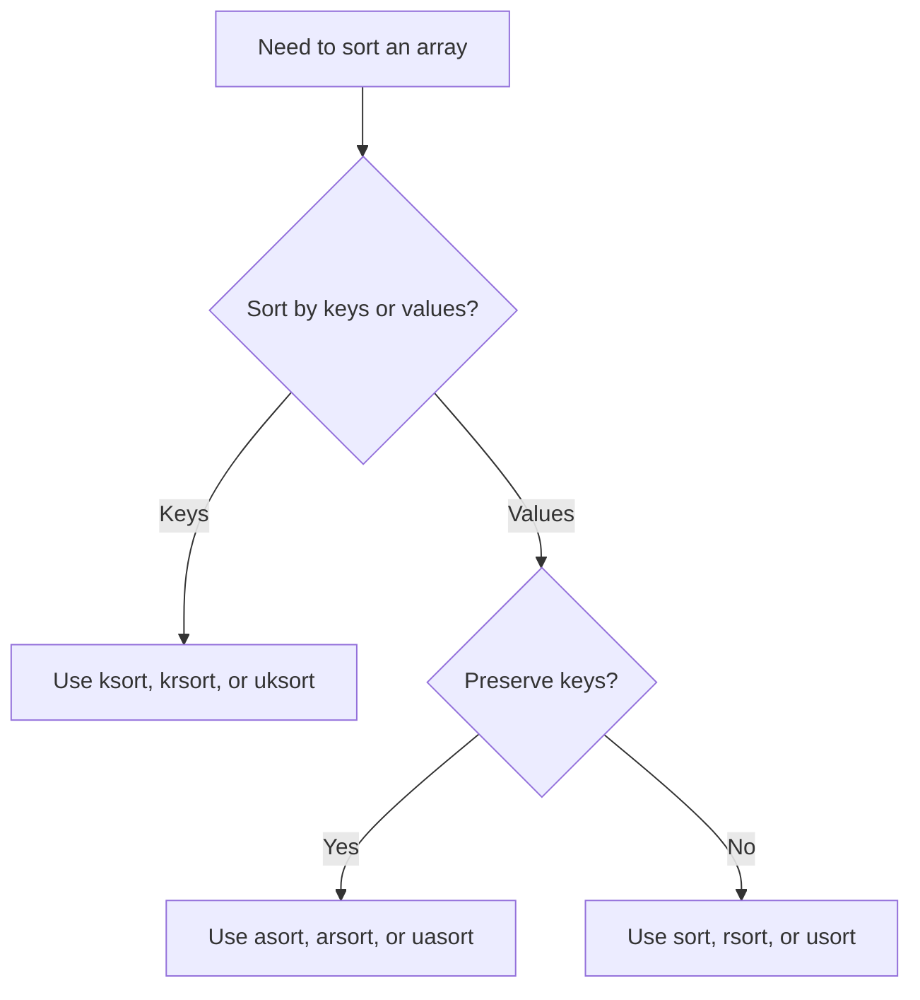

# PHP Array Sorting

## Table of Contents

- [Overview](#overview)
- [Sorting Function Comparison](#sorting-function-comparison)
- [Sort Indexed Arrays](#sort-indexed-arrays)
- [Preserve Associative Keys](#preserve-associative-keys)
- [Sort by Keys](#sort-by-keys)
- [Custom Sorting](#custom-sorting)
- [Common Mistakes](#common-mistakes)
- [Practice](#practice)
- [Official Documentation](#official-documentation)

## Overview

PHP provides different sorting functions depending on whether you need to sort by values or keys and whether keys must be preserved.

| Function | Sort by | Direction | Preserve keys |
|---|---|---|---|
| `sort()` | Values | Ascending | No |
| `rsort()` | Values | Descending | No |
| `asort()` | Values | Ascending | Yes |
| `arsort()` | Values | Descending | Yes |
| `ksort()` | Keys | Ascending | Yes |
| `krsort()` | Keys | Descending | Yes |
| `usort()` | Values | Custom | No |
| `uasort()` | Values | Custom | Yes |
| `uksort()` | Keys | Custom | Yes |

## Sorting Function Comparison



## Sort Indexed Arrays

Ascending:

```php
<?php

$numbers = [30, 10, 20];

sort($numbers);
```

Descending:

```php
<?php

rsort($numbers);
```

These functions reset numeric indexes.

## Preserve Associative Keys

```php
<?php

$scores = [
    'Alan' => 85,
    'Anna' => 95,
    'John' => 75,
];

asort($scores);
```

Use `arsort()` for descending order.

## Sort by Keys

```php
<?php

$user = [
    'role' => 'Developer',
    'name' => 'Alan',
    'age' => 26,
];

ksort($user);
```

Use `krsort()` for descending key order.

## Custom Sorting

Sort products by price:

```php
<?php

$products = [
    ['name' => 'Keyboard', 'price' => 50],
    ['name' => 'Mouse', 'price' => 25],
    ['name' => 'Monitor', 'price' => 200],
];

usort(
    $products,
    fn (array $first, array $second): int =>
        $first['price'] <=> $second['price']
);
```

Descending:

```php
<?php

usort(
    $products,
    fn (array $first, array $second): int =>
        $second['price'] <=> $first['price']
);
```

Preserve existing keys with `uasort()`:

```php
<?php

uasort(
    $products,
    fn (array $first, array $second): int =>
        $first['price'] <=> $second['price']
);
```

The callback should return:

- A negative number when the first value should come first.
- Zero when both values are equal.
- A positive number when the second value should come first.

## Common Mistakes

### Expecting a sorted array as the return value

Incorrect:

```php
$sorted = sort($numbers);
```

`sort()` modifies `$numbers` and returns `true` or `false`.

Correct:

```php
sort($numbers);
$sorted = $numbers;
```

### Losing important keys

Use `asort()`, `arsort()`, or `uasort()` when keys must be preserved.

### Reversing spaceship operands incorrectly

```php
$first['price'] <=> $second['price']; // ascending
$second['price'] <=> $first['price']; // descending
```

## Practice

```php
<?php

$users = [
    ['name' => 'Alan', 'age' => 26],
    ['name' => 'Anna', 'age' => 24],
    ['name' => 'John', 'age' => 30],
];

usort(
    $users,
    fn (array $first, array $second): int =>
        $first['age'] <=> $second['age']
);
```

## Official Documentation

- [Array sorting functions](https://www.php.net/manual/en/array.sorting.php)
- [`usort()`](https://www.php.net/manual/en/function.usort.php)
- [`uasort()`](https://www.php.net/manual/en/function.uasort.php)
- [`uksort()`](https://www.php.net/manual/en/function.uksort.php)
