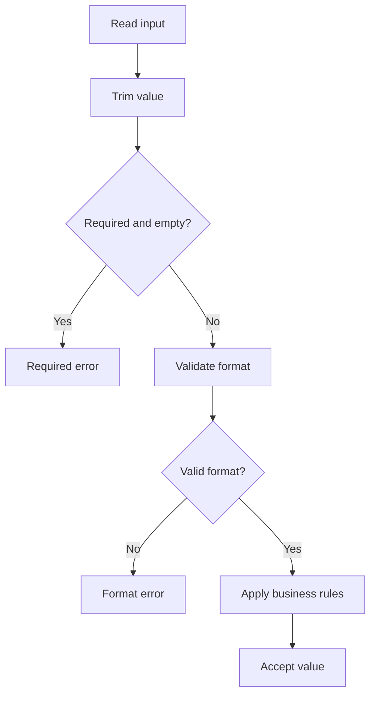

# PHP Email and URL Validation

## Email Validation

Use `FILTER_VALIDATE_EMAIL` to check email syntax.

```php
<?php

$email = trim($_POST['email'] ?? '');

if ($email === '') {
    $errors['email'] = 'Email is required.';
} elseif (mb_strlen($email) > 254) {
    $errors['email'] = 'Email is too long.';
} elseif (filter_var($email, FILTER_VALIDATE_EMAIL) === false) {
    $errors['email'] = 'Enter a valid email address.';
}
```

Reusable validator:

```php
<?php

function validateEmail(string $email): ?string
{
    if ($email === '') {
        return 'Email is required.';
    }

    if (mb_strlen($email) > 254) {
        return 'Email is too long.';
    }

    if (filter_var($email, FILTER_VALIDATE_EMAIL) === false) {
        return 'Enter a valid email address.';
    }

    return null;
}
```

Format validation does not prove that the mailbox exists or belongs to the user. For registration, send a confirmation link or code.

## URL Validation

```php
<?php

$url = trim($_POST['website'] ?? '');

if ($url !== '' && filter_var($url, FILTER_VALIDATE_URL) === false) {
    $errors['website'] = 'Enter a valid URL.';
}
```

A structurally valid URL may still use an unwanted scheme. Validate the scheme separately:

```php
<?php

function validateHttpUrl(string $url): ?string
{
    if ($url === '') {
        return null;
    }

    if (filter_var($url, FILTER_VALIDATE_URL) === false) {
        return 'Enter a valid URL.';
    }

    $scheme = parse_url($url, PHP_URL_SCHEME);

    if (!in_array($scheme, ['http', 'https'], true)) {
        return 'Only HTTP and HTTPS URLs are allowed.';
    }

    return null;
}
```

## Validation Flow



## Security Notes

When a server fetches a user-provided URL, stricter checks may be required for hostname, port, redirects, DNS results, and private IP ranges. Otherwise, the application may be vulnerable to server-side request forgery.

For links rendered into HTML:

1. Validate the URL.
2. Allow expected schemes.
3. Escape the HTML attribute value.

```php
<a href="<?= htmlspecialchars($url, ENT_QUOTES, 'UTF-8') ?>">Website</a>
```

## Common Mistakes

- Writing a large custom email regex when the standard filter is sufficient.
- Assuming a valid email format proves mailbox ownership.
- Validating URL syntax but allowing unsafe schemes.
- Letting the server fetch arbitrary user URLs without SSRF controls.
- Rendering values into HTML without escaping.

## Practice

Create a form with a required email and optional website. Validate the email length and format, then allow only HTTP and HTTPS website URLs.

## Official Documentation

- [`FILTER_VALIDATE_EMAIL`](https://www.php.net/manual/en/filter.constants.php)
- [`FILTER_VALIDATE_URL`](https://www.php.net/manual/en/filter.constants.php)
- [`filter_var()`](https://www.php.net/manual/en/function.filter-var.php)
- [`parse_url()`](https://www.php.net/manual/en/function.parse-url.php)
