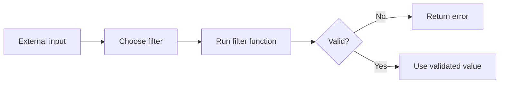

# PHP Filters

## Overview

PHP provides filter functions for validating and transforming external data.

Main functions:

- `filter_var()`
- `filter_input()`
- `filter_input_array()`
- `filter_var_array()`



## `filter_var()`

Validate an existing value:

```php
<?php

$value = '42';
$number = filter_var($value, FILTER_VALIDATE_INT);

if ($number === false) {
    echo 'Invalid integer.';
} else {
    echo $number;
}
```

Integer range:

```php
<?php

$age = filter_var(
    $_POST['age'] ?? null,
    FILTER_VALIDATE_INT,
    [
        'options' => [
            'min_range' => 18,
            'max_range' => 120,
        ],
    ]
);
```

Boolean validation:

```php
<?php

$active = filter_var(
    $_POST['active'] ?? null,
    FILTER_VALIDATE_BOOLEAN,
    FILTER_NULL_ON_FAILURE
);
```

## `filter_input()`

Read and filter one external input value:

```php
<?php

$page = filter_input(
    INPUT_GET,
    'page',
    FILTER_VALIDATE_INT,
    [
        'options' => [
            'default' => 1,
            'min_range' => 1,
        ],
    ]
);
```

`filter_input()` reads original external input and does not automatically use later changes made to `$_GET` or `$_POST`.

Always specify an intended filter. The default filter does not perform meaningful validation.

## `filter_input_array()`

```php
<?php

$input = filter_input_array(
    INPUT_POST,
    [
        'email' => FILTER_VALIDATE_EMAIL,
        'age' => [
            'filter' => FILTER_VALIDATE_INT,
            'options' => [
                'min_range' => 18,
                'max_range' => 120,
            ],
        ],
        'website' => FILTER_VALIDATE_URL,
    ]
);
```

Do not assume one call expresses every business rule. Distinguish missing, empty, invalid, and valid values.

## Common Validation Filters

| Filter | Purpose |
|---|---|
| `FILTER_VALIDATE_BOOLEAN` | Boolean values |
| `FILTER_VALIDATE_EMAIL` | Email format |
| `FILTER_VALIDATE_FLOAT` | Floating-point values |
| `FILTER_VALIDATE_INT` | Integer values |
| `FILTER_VALIDATE_IP` | IP addresses |
| `FILTER_VALIDATE_MAC` | MAC addresses |
| `FILTER_VALIDATE_REGEXP` | Custom regular-expression rule |
| `FILTER_VALIDATE_URL` | URL format |

Use strict checks:

```php
<?php

$integer = filter_var('0', FILTER_VALIDATE_INT);

if ($integer === false) {
    echo 'Invalid';
}
```

## Sanitization Filters

Sanitization transforms data but does not prove that the result is valid.

`FILTER_DEFAULT` is an alias of `FILTER_UNSAFE_RAW`, so it performs no meaningful validation by default.

For HTML output, escape at rendering time:

```php
<?php

echo htmlspecialchars(
    $value,
    ENT_QUOTES | ENT_SUBSTITUTE,
    'UTF-8'
);
```

For SQL, use prepared statements instead of manually sanitizing SQL strings.

## JSON Request Bodies

JSON bodies are not normally placed in `$_POST`.

```php
<?php

$rawBody = file_get_contents('php://input');

try {
    $data = json_decode(
        $rawBody,
        true,
        512,
        JSON_THROW_ON_ERROR
    );
} catch (JsonException $exception) {
    http_response_code(400);
    exit('Invalid JSON.');
}
```

Validate the decoded structure and each field explicitly.

## Common Mistakes

- Assuming default filters validate input.
- Using `if (!$value)` when zero is valid.
- Treating sanitization as validation.
- Expecting JSON bodies in `$_POST`.
- Skipping business validation after type or format validation.
- Forgetting output-context escaping.

## Practice

Use `filter_input_array()` to validate email, age, website, and active status. Add separate required and allowlist checks where needed.

## Official Documentation

- [PHP filter extension](https://www.php.net/manual/en/book.filter.php)
- [`filter_var()`](https://www.php.net/manual/en/function.filter-var.php)
- [`filter_input()`](https://www.php.net/manual/en/function.filter-input.php)
- [`filter_input_array()`](https://www.php.net/manual/en/function.filter-input-array.php)
- [Validation filters](https://www.php.net/manual/en/filter.filters.validate.php)
- [Filter constants](https://www.php.net/manual/en/filter.constants.php)
