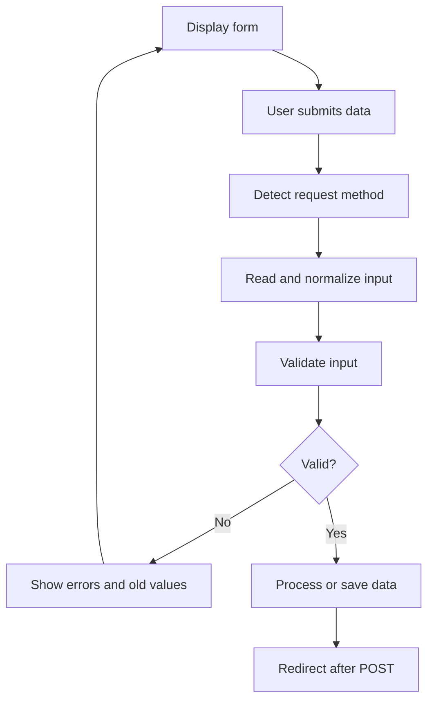
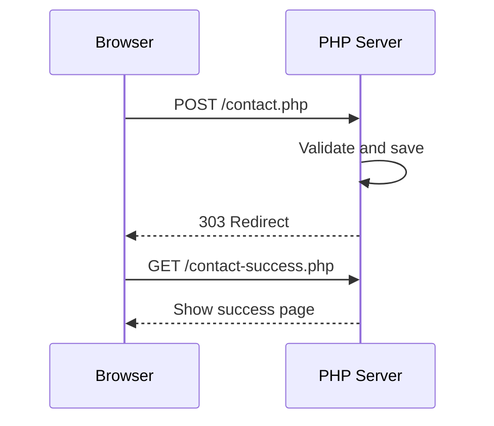

# PHP Form Handling

## Overview

A secure form workflow is:



## Basic GET Form

```php
<?php

$query = trim($_GET['q'] ?? '');
?>

<form method="get">
    <input
        name="q"
        type="search"
        value="<?= htmlspecialchars($query, ENT_QUOTES, 'UTF-8') ?>"
    >
    <button type="submit">Search</button>
</form>
```

## Basic POST Form

```php
<?php

$name = '';
$message = '';

if (($_SERVER['REQUEST_METHOD'] ?? '') === 'POST') {
    $name = trim($_POST['name'] ?? '');
    $message = trim($_POST['message'] ?? '');
}
?>

<form method="post">
    <input
        name="name"
        value="<?= htmlspecialchars($name, ENT_QUOTES, 'UTF-8') ?>"
    >

    <textarea name="message"><?= htmlspecialchars($message, ENT_QUOTES, 'UTF-8') ?></textarea>

    <button type="submit">Send</button>
</form>
```

## Detect the Request Method

```php
<?php

function isPostRequest(): bool
{
    return ($_SERVER['REQUEST_METHOD'] ?? '') === 'POST';
}
```

## Keep Old Values

Preserve submitted values after validation errors, but escape them before inserting them into HTML.

Selected option:

```php
<option
    value="developer"
    <?= $role === 'developer' ? 'selected' : '' ?>
>
    Developer
</option>
```

Checkbox:

```php
<input
    type="checkbox"
    name="accepted_terms"
    value="1"
    <?= isset($_POST['accepted_terms']) ? 'checked' : '' ?>
>
```

## Validation Errors

Use an associative array keyed by field name:

```php
<?php

$errors = [];

if ($name === '') {
    $errors['name'] = 'Name is required.';
}
```

```php
<?php if (isset($errors['name'])): ?>
    <p role="alert">
        <?= htmlspecialchars($errors['name'], ENT_QUOTES, 'UTF-8') ?>
    </p>
<?php endif; ?>
```

## Post-Redirect-Get

After successfully processing POST data, redirect to a GET page:

```php
<?php

header('Location: /contact-success.php', true, 303);
exit;
```



This reduces accidental duplicate submissions. Headers must be sent before normal output, and `exit` should follow the redirect.

## CSRF Protection

State-changing forms should include a random token stored in the session.

```php
<?php

session_start();
$_SESSION['csrf_token'] ??= bin2hex(random_bytes(32));
```

Validate submitted tokens with `hash_equals()`.

## Best Practices

- Validate on the server even when HTML validation exists.
- Preserve old values after errors.
- Escape values at output time.
- Use CSRF protection for state changes.
- Redirect after successful POST.
- Use prepared statements for database writes.
- Limit input length and request size.

## Practice

Build a contact form with name, email, and message fields. Add required validation, old values, field-level errors, a CSRF token, and a 303 redirect after success.

## Official Documentation

- [PHP forms tutorial](https://www.php.net/manual/en/tutorial.forms.php)
- [HTTP headers](https://www.php.net/manual/en/function.header.php)
- [Sessions](https://www.php.net/manual/en/book.session.php)
