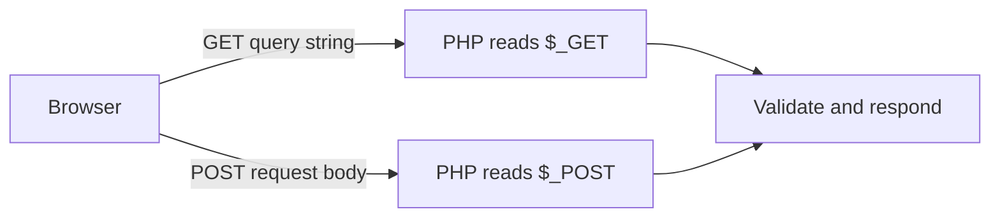

# PHP GET and POST

## Overview

GET and POST are HTTP methods commonly used with forms.



## GET Requests

GET is mainly used to retrieve, search, filter, sort, or paginate data.

```html
<form method="get" action="/search.php">
    <label for="q">Search</label>
    <input id="q" name="q" type="search">
    <button type="submit">Search</button>
</form>
```

Submitting `php` may create:

```text
/search.php?q=php
```

```php
<?php

$query = trim($_GET['q'] ?? '');

if ($query !== '') {
    echo htmlspecialchars($query, ENT_QUOTES, 'UTF-8');
}
```

Use GET for shareable page state. Never place passwords or sensitive personal data in URLs because URLs may appear in history, logs, analytics, bookmarks, and referrer headers.

## POST Requests

POST is mainly used to submit data or change server state.

```html
<form method="post" action="/register.php">
    <label for="email">Email</label>
    <input id="email" name="email" type="email">
    <button type="submit">Register</button>
</form>
```

```php
<?php

if (($_SERVER['REQUEST_METHOD'] ?? '') === 'POST') {
    $email = trim($_POST['email'] ?? '');
    echo htmlspecialchars($email, ENT_QUOTES, 'UTF-8');
}
```

POST is common for registration, login, create, update, delete, contact forms, and file uploads.

POST is not encryption. Use HTTPS for sensitive requests.

## GET vs POST

| Feature | GET | POST |
|---|---|---|
| Main purpose | Retrieve or search | Submit or change data |
| Data location | URL query string | Request body |
| Bookmarkable | Yes | Normally no |
| Visible in URL | Yes | No |
| Typical use | Search, filters, pagination | Create, update, login, upload |
| Refresh behavior | Repeats retrieval | May attempt resubmission |

A GET request should generally not update or delete data.

Bad:

```text
GET /delete-user.php?id=10
```

Better:

```text
POST /users/delete
```

with authorization and CSRF protection.

## Detect the Method

```php
<?php

$requestMethod = $_SERVER['REQUEST_METHOD'] ?? 'GET';

if ($requestMethod === 'POST') {
    // Process submitted form.
}
```

## Common Mistakes

- Treating POST as secure without HTTPS.
- Using GET for destructive actions.
- Reading missing keys directly.
- Trusting request values without validation.
- Forgetting CSRF protection for state-changing forms.

## Practice

Create a GET search form and a POST contact form. For both forms:

1. Read values safely with `??`.
2. Normalize with `trim()`.
3. Validate on the server.
4. Escape values with `htmlspecialchars()` when rendering HTML.

## Official Documentation

- [PHP `$_GET`](https://www.php.net/manual/en/reserved.variables.get.php)
- [PHP `$_POST`](https://www.php.net/manual/en/reserved.variables.post.php)
- [PHP superglobals](https://www.php.net/manual/en/language.variables.superglobals.php)
