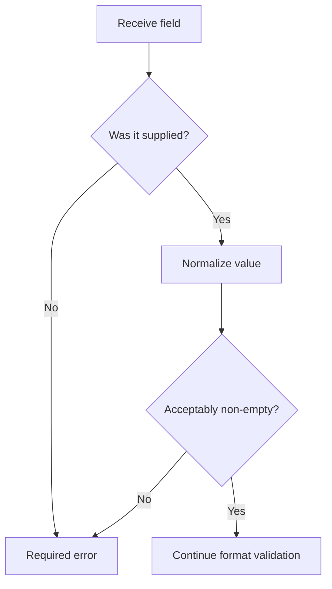

# PHP Required Fields

## Overview

A required field must contain an acceptable value. HTML can help users, but PHP must always validate required fields on the server.

```html
<input type="text" name="name" required>
```

```php
<?php

$name = trim($_POST['name'] ?? '');

if ($name === '') {
    $errors['name'] = 'Name is required.';
}
```

## Why Server Validation Is Required

Browser validation can be disabled or bypassed. Requests can also come from scripts, API clients, or modified HTML.



## Avoid Blind Use of `empty()`

```php
<?php

$value = '0';
var_dump(empty($value)); // true
```

The string `'0'` may be valid. Use rules appropriate for the field.

For required text:

```php
$value === ''
```

For a required checkbox group:

```php
<?php

$interests = $_POST['interests'] ?? [];

if (!is_array($interests) || $interests === []) {
    $errors['interests'] = 'Choose at least one interest.';
}
```

## Required Integer

```php
<?php

$rawAge = $_POST['age'] ?? '';
$age = filter_var($rawAge, FILTER_VALIDATE_INT);

if ($rawAge === '') {
    $errors['age'] = 'Age is required.';
} elseif ($age === false) {
    $errors['age'] = 'Enter a valid age.';
}
```

Distinguish missing, empty, invalid, and valid zero values with strict comparisons.

## Required Checkbox

Unchecked checkboxes are usually absent from `$_POST`.

```php
<?php

$acceptedTerms = isset($_POST['accepted_terms']);

if (!$acceptedTerms) {
    $errors['accepted_terms'] = 'You must accept the terms.';
}
```

## Required Select

```php
<?php

$role = $_POST['role'] ?? '';
$allowedRoles = ['developer', 'designer', 'tester'];

if ($role === '') {
    $errors['role'] = 'Choose a role.';
} elseif (!in_array($role, $allowedRoles, true)) {
    $errors['role'] = 'Choose a valid role.';
}
```

## Display Errors

```php
<?php if (isset($errors['name'])): ?>
    <p role="alert">
        <?= htmlspecialchars($errors['name'], ENT_QUOTES, 'UTF-8') ?>
    </p>
<?php endif; ?>
```

## Common Mistakes

- Depending only on the HTML `required` attribute.
- Treating `'0'` as missing without checking business rules.
- Assuming unchecked checkboxes submit an empty value.
- Checking required state but not validating format or allowed values.
- Displaying errors or old values without HTML escaping.

## Practice

Build a form containing required name, age, role, terms checkbox, and interests array. Store field-specific errors in an associative array.

## Official Documentation

- [PHP forms tutorial](https://www.php.net/manual/en/tutorial.forms.php)
- [PHP comparison types](https://www.php.net/manual/en/types.comparisons.php)
- [Validation filters](https://www.php.net/manual/en/filter.filters.validate.php)
