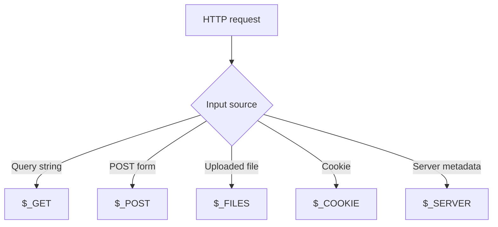

# PHP Superglobals

## Table of Contents

- [Overview](#overview)
- [`$_GET`](#_get)
- [`$_POST`](#_post)
- [`$_SERVER`](#_server)
- [`$_FILES`](#_files)
- [`$_COOKIE`](#_cookie)
- [`$_SESSION`](#_session)
- [`$_REQUEST`](#_request)
- [`$_ENV` and `$GLOBALS`](#_env-and-globals)
- [Security Notes](#security-notes)
- [Practice](#practice)
- [Official Documentation](#official-documentation)

## Overview

Superglobals are built-in PHP arrays available in every scope.

| Superglobal | Purpose |
|---|---|
| `$_GET` | URL query parameters |
| `$_POST` | Standard POST form data |
| `$_SERVER` | Request and server information |
| `$_FILES` | Uploaded-file metadata |
| `$_COOKIE` | Cookies sent by the browser |
| `$_SESSION` | Server-side session data |
| `$_REQUEST` | Combined request data, depending on configuration |
| `$_ENV` | Environment variables |
| `$GLOBALS` | Variables from global scope |



Never assume a request key exists:

```php
<?php

$name = $_GET['name'] ?? 'Guest';
```

## `$_GET`

`$_GET` contains values from the URL query string.

Example URL:

```text
/search.php?q=php&page=2
```

```php
<?php

$query = $_GET['q'] ?? '';
$page = $_GET['page'] ?? '1';
```

Request values generally arrive as strings, so validate and convert numeric data before using it.

## `$_POST`

`$_POST` contains standard POST form data.

```html
<form method="post">
    <input name="username" type="text">
    <button type="submit">Send</button>
</form>
```

```php
<?php

$username = $_POST['username'] ?? '';
```

JSON request bodies are not automatically added to `$_POST`.

## `$_SERVER`

Common request values:

```php
<?php

$requestMethod = $_SERVER['REQUEST_METHOD'] ?? '';
$requestUri = $_SERVER['REQUEST_URI'] ?? '';
$userAgent = $_SERVER['HTTP_USER_AGENT'] ?? '';
$remoteAddress = $_SERVER['REMOTE_ADDR'] ?? '';
```

Header-derived values such as `HTTP_HOST` and `HTTP_USER_AGENT` are client-controlled and must not be blindly trusted.

## `$_FILES`

File-upload forms require:

```html
<form method="post" enctype="multipart/form-data">
    <input type="file" name="document">
</form>
```

```php
<?php

$file = $_FILES['document'] ?? null;

if ($file !== null) {
    echo $file['name'];
    echo $file['tmp_name'];
    echo $file['error'];
    echo $file['size'];
}
```

Do not trust the submitted filename or MIME type. Validate the upload error, size, detected MIME type, destination, and generated server filename.

## `$_COOKIE`

```php
<?php

$theme = $_COOKIE['theme'] ?? 'light';
```

Cookies are client-controlled. Do not use a plain cookie value as proof of authentication or authorization.

## `$_SESSION`

Start the session before accessing session data:

```php
<?php

session_start();

$_SESSION['user_id'] = 123;
```

Sessions are commonly used for login state, CSRF tokens, flash messages, carts, and temporary workflow data.

## `$_REQUEST`

`$_REQUEST` may combine GET, POST, and cookie data depending on PHP configuration.

Avoid it in normal application code because the source is unclear.

Prefer:

```php
$_GET
$_POST
$_COOKIE
```

## `$_ENV` and `$GLOBALS`

```php
<?php

$appEnvironment = $_ENV['APP_ENV'] ?? 'production';
```

Do not expose secrets from environment variables.

`$GLOBALS` can access global variables:

```php
<?php

$message = 'Hello';

function showMessage(): void
{
    echo $GLOBALS['message'];
}
```

Passing values through function parameters is usually clearer and easier to test.

## Security Notes

- Treat all request, cookie, upload, and header values as untrusted.
- Use explicit superglobals instead of `$_REQUEST`.
- Validate type, format, length, range, and allowed values.
- Escape values for their output context.
- Protect state-changing requests with CSRF tokens.
- Use prepared statements for SQL.

## Practice

Read a search query and page number safely:

```php
<?php

$query = trim($_GET['q'] ?? '');
$page = filter_input(
    INPUT_GET,
    'page',
    FILTER_VALIDATE_INT,
    [
        'options' => [
            'default' => 1,
            'min_range' => 1,
        ],
    ]
);
```

## Official Documentation

- [PHP superglobals](https://www.php.net/manual/en/language.variables.superglobals.php)
- [`$_GET`](https://www.php.net/manual/en/reserved.variables.get.php)
- [`$_POST`](https://www.php.net/manual/en/reserved.variables.post.php)
- [`$_SERVER`](https://www.php.net/manual/en/reserved.variables.server.php)
- [`$_FILES`](https://www.php.net/manual/en/reserved.variables.files.php)
- [Sessions](https://www.php.net/manual/en/book.session.php)
