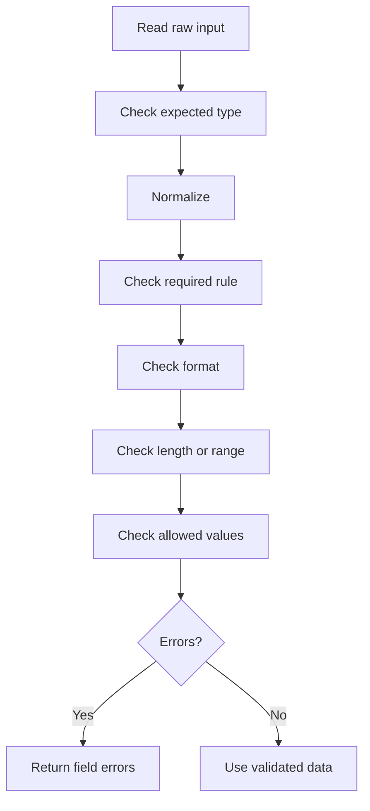

# PHP Form Validation

## Overview

Validation checks whether input follows application rules.



## Validation, Sanitization, and Escaping

| Operation | Purpose | Example |
|---|---|---|
| Normalization | Make input consistent | `trim($name)` |
| Validation | Decide whether input is acceptable | `FILTER_VALIDATE_EMAIL` |
| Sanitization | Remove or transform selected content | A specific sanitize filter |
| Escaping | Make output safe for a destination | `htmlspecialchars()` for HTML |

Do not confuse these operations. Usually, store validated original data and escape it when rendering.

## Basic Validation

```php
<?php

$name = trim($_POST['name'] ?? '');
$email = trim($_POST['email'] ?? '');
$errors = [];

if ($name === '') {
    $errors['name'] = 'Name is required.';
} elseif (mb_strlen($name) > 100) {
    $errors['name'] = 'Name must not exceed 100 characters.';
}

if ($email === '') {
    $errors['email'] = 'Email is required.';
} elseif (filter_var($email, FILTER_VALIDATE_EMAIL) === false) {
    $errors['email'] = 'Enter a valid email address.';
}
```

## Allowed Values

Use an allowlist:

```php
<?php

$role = $_POST['role'] ?? '';
$allowedRoles = ['admin', 'editor', 'viewer'];

if (!in_array($role, $allowedRoles, true)) {
    $errors['role'] = 'Choose a valid role.';
}
```

## Numeric Validation

```php
<?php

$age = filter_var(
    $_POST['age'] ?? null,
    FILTER_VALIDATE_INT,
    [
        'options' => [
            'min_range' => 18,
            'max_range' => 120,
        ],
    ]
);

if ($age === false) {
    $errors['age'] = 'Age must be between 18 and 120.';
}
```

Use strict checks because `0` may be valid but false-like.

## Error Structure

```php
<?php

$errors = [
    'name' => 'Name is required.',
    'email' => 'Enter a valid email address.',
];
```

Render errors safely:

```php
<?php if (isset($errors['email'])): ?>
    <p role="alert">
        <?= htmlspecialchars($errors['email'], ENT_QUOTES, 'UTF-8') ?>
    </p>
<?php endif; ?>
```

## Security Notes

Validation does not replace:

- HTML escaping for XSS protection.
- CSRF tokens for state-changing forms.
- Prepared statements for SQL injection protection.
- Authorization checks.
- Upload MIME and size validation.

## Common Mistakes

- Trusting client-side validation.
- Escaping too early and storing HTML entities.
- Treating sanitization as proof of validity.
- Using loose comparisons for filtered numeric values.
- Forgetting business rules after format validation.

## Practice

Create a registration validator for name, email, password, password confirmation, and role. Return an associative error array rather than printing errors inside the validator.

## Official Documentation

- [PHP filter extension](https://www.php.net/manual/en/book.filter.php)
- [Validation filters](https://www.php.net/manual/en/filter.filters.validate.php)
- [`filter_var()`](https://www.php.net/manual/en/function.filter-var.php)
