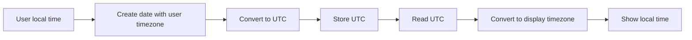

# Date and Time

## Table of Contents

- [1. Overview](#1-overview)
- [2. Set the Timezone](#2-set-the-timezone)
- [3. Current Date and Time](#3-current-date-and-time)
- [4. `DateTimeImmutable`](#4-datetimeimmutable)
- [5. Parse and Validate Dates](#5-parse-and-validate-dates)
- [6. Add and Subtract Time](#6-add-and-subtract-time)
- [7. Compare Dates](#7-compare-dates)
- [8. Date Differences](#8-date-differences)
- [9. Store UTC and Display Local Time](#9-store-utc-and-display-local-time)
- [10. Common Mistakes](#10-common-mistakes)
- [11. Practice](#11-practice)
- [12. Official Resources](#12-official-resources)

---

## 1. Overview

Use an explicit timezone and prefer `DateTimeImmutable` for application logic. It returns a new object when changed, reducing accidental mutation.



---

## 2. Set the Timezone

```php
<?php

date_default_timezone_set('Asia/Ho_Chi_Minh');
```

Do not depend on an unknown server default.

You can also create a timezone object:

```php
<?php

$timezone = new DateTimeZone('Asia/Ho_Chi_Minh');
```

---

## 3. Current Date and Time

```php
<?php

echo date('Y-m-d H:i:s');
```

Unix timestamp:

```php
<?php

$timestamp = time();
```

Common format characters:

| Character | Meaning | Example |
|---|---|---|
| `Y` | Four-digit year | `2026` |
| `m` | Two-digit month | `07` |
| `d` | Two-digit day | `31` |
| `H` | Hour in 24-hour format | `16` |
| `i` | Minutes | `08` |
| `s` | Seconds | `45` |
| `F` | Full month name | `July` |
| `c` | ISO 8601 date | `2026-07-31T16:08:45+07:00` |

---

## 4. `DateTimeImmutable`

```php
<?php

$timezone = new DateTimeZone('Asia/Ho_Chi_Minh');
$now = new DateTimeImmutable('now', $timezone);

echo $now->format(DATE_ATOM);
```

Specific date:

```php
<?php

$date = new DateTimeImmutable(
    '2026-07-31 16:08:00',
    new DateTimeZone('Asia/Ho_Chi_Minh')
);
```

Changing an immutable date creates a new object:

```php
<?php

$tomorrow = $date->modify('+1 day');

var_dump($date !== $tomorrow); // true
```

---

## 5. Parse and Validate Dates

```php
<?php

$input = '31/07/2026';
$timezone = new DateTimeZone('Asia/Ho_Chi_Minh');

$date = DateTimeImmutable::createFromFormat(
    '!d/m/Y',
    $input,
    $timezone
);

$errors = DateTimeImmutable::getLastErrors();

$isValid = $date !== false
    && (
        !is_array($errors)
        || (
            $errors['warning_count'] === 0
            && $errors['error_count'] === 0
        )
    )
    && $date->format('d/m/Y') === $input;

if (!$isValid) {
    echo 'Invalid date.';
}
```

Checking warnings is important because PHP may normalize an invalid calendar date such as `31/02/2026`.

---

## 6. Add and Subtract Time

Using `modify()`:

```php
<?php

$date = new DateTimeImmutable('2026-07-31');

$tomorrow = $date->modify('+1 day');
$nextWeek = $date->modify('+1 week');
$previousMonth = $date->modify('-1 month');
```

Using `DateInterval`:

```php
<?php

$threeDaysLater = $date->add(
    new DateInterval('P3D')
);

$twoHoursEarlier = $date->sub(
    new DateInterval('PT2H')
);
```

| Interval | Meaning |
|---|---|
| `P1D` | One day |
| `P2W` | Two weeks |
| `P3M` | Three months |
| `P1Y` | One year |
| `PT2H` | Two hours |
| `PT30M` | Thirty minutes |

---

## 7. Compare Dates

```php
<?php

$start = new DateTimeImmutable('2026-08-01');
$end = new DateTimeImmutable('2026-08-10');

if ($end < $start) {
    echo 'The end date is invalid.';
}
```

Check a deadline:

```php
<?php

$deadline = new DateTimeImmutable('2026-08-10');
$now = new DateTimeImmutable();

if ($deadline < $now) {
    echo 'The deadline has passed.';
}
```

---

## 8. Date Differences

```php
<?php

$start = new DateTimeImmutable('2026-08-01');
$end = new DateTimeImmutable('2026-08-10');

$difference = $start->diff($end);

echo $difference->days; // 9
```

Detailed output:

```php
<?php

echo $difference->format(
    '%y years, %m months, %d days'
);
```

---

## 9. Store UTC and Display Local Time

Convert local time to UTC:

```php
<?php

$localDate = new DateTimeImmutable(
    '2026-07-31 16:08:00',
    new DateTimeZone('Asia/Ho_Chi_Minh')
);

$utcDate = $localDate->setTimezone(
    new DateTimeZone('UTC')
);

echo $utcDate->format('Y-m-d H:i:s');
```

Convert stored UTC to local time:

```php
<?php

$storedDate = new DateTimeImmutable(
    '2026-07-31 09:08:00',
    new DateTimeZone('UTC')
);

$displayDate = $storedDate->setTimezone(
    new DateTimeZone('Asia/Ho_Chi_Minh')
);

echo $displayDate->format('d/m/Y H:i');
```

Use ISO 8601 for APIs and logs:

```php
<?php

echo $utcDate->format(DATE_ATOM);
```

---

## 10. Common Mistakes

- Depending on the server's default timezone.
- Using mutable `DateTime` where immutable behavior is safer.
- Parsing dates without checking warnings and errors.
- Storing local timestamps without timezone information.
- Comparing formatted date strings instead of date objects.
- Assuming every day contains exactly 24 hours across daylight-saving transitions.
- Using ambiguous formats such as `07/08/2026` without defining day/month order.

---

## 11. Practice

### Exercise 1: Validate a date

Validate `d/m/Y` and reject impossible calendar dates.

### Exercise 2: Calculate a deadline

```php
<?php

$start = new DateTimeImmutable('2026-08-01');
$deadline = $start->add(new DateInterval('P14D'));

echo $deadline->format('Y-m-d');
```

### Exercise 3: Convert UTC

Convert a stored UTC timestamp to `Asia/Ho_Chi_Minh` for display.

### Checklist

- [ ] I set an explicit application timezone.
- [ ] I can create and format immutable dates.
- [ ] I can validate calendar dates.
- [ ] I can add, subtract, compare, and diff dates.
- [ ] I store UTC and convert it for display.

---

## 12. Official Resources

- [PHP date and time](https://www.php.net/manual/en/book.datetime.php)
- [`DateTimeImmutable`](https://www.php.net/manual/en/class.datetimeimmutable.php)
- [`DateInterval`](https://www.php.net/manual/en/class.dateinterval.php)
- [Date formats](https://www.php.net/manual/en/datetime.format.php)
- [Supported time zones](https://www.php.net/manual/en/timezones.php)
