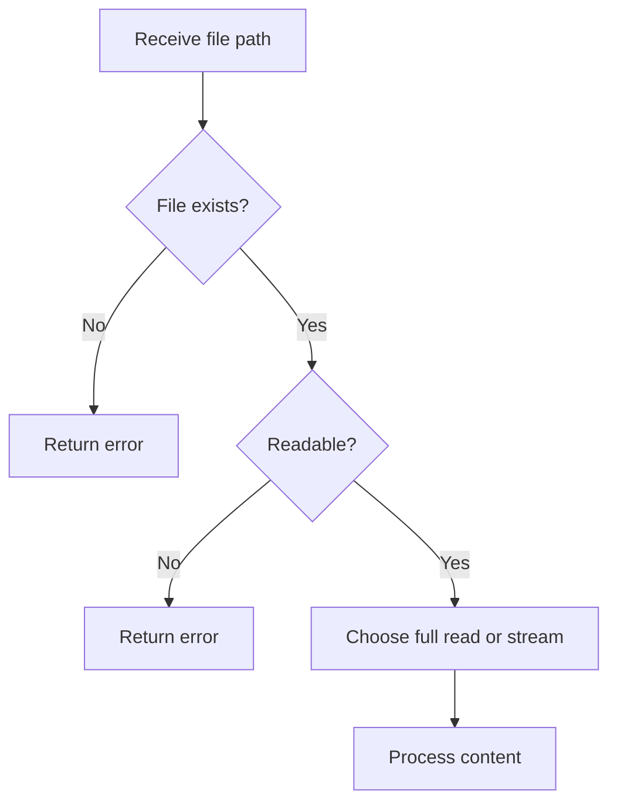

# File Read

## Table of Contents

- [1. Overview](#1-overview)
- [2. File Checks](#2-file-checks)
- [3. `file_get_contents()`](#3-file_get_contents)
- [4. `file()`](#4-file)
- [5. `fopen()` and `fgets()`](#5-fopen-and-fgets)
- [6. Read JSON](#6-read-json)
- [7. Common Mistakes](#7-common-mistakes)
- [8. Practice](#8-practice)
- [9. Official Resources](#9-official-resources)

---

## 1. Overview

PHP can read an entire small file, load lines into an array, or stream a large file line by line.

| Function | Best use |
|---|---|
| `file_get_contents()` | Read a complete small file |
| `file()` | Read lines into an array |
| `fopen()` and `fgets()` | Stream large files |
| `json_decode()` | Convert JSON text to PHP data |



---

## 2. File Checks

```php
<?php

file_exists($path);
is_file($path);
is_dir($path);
is_readable($path);
is_writable($path);
filesize($path);
realpath($path);
pathinfo($path);
```

Always validate a path before reading it.

---

## 3. `file_get_contents()`

```php
<?php

$filePath = __DIR__ . '/storage/data/message.txt';

if (!is_file($filePath)) {
    throw new RuntimeException('The file does not exist.');
}

if (!is_readable($filePath)) {
    throw new RuntimeException('The file is not readable.');
}

$content = file_get_contents($filePath);

if ($content === false) {
    throw new RuntimeException('Could not read the file.');
}

echo $content;
```

This function loads the complete file into memory, so it is best for small files.

---

## 4. `file()`

```php
<?php

$lines = file(
    __DIR__ . '/technologies.txt',
    FILE_IGNORE_NEW_LINES | FILE_SKIP_EMPTY_LINES
);

if ($lines === false) {
    throw new RuntimeException('Could not read the file.');
}

foreach ($lines as $line) {
    echo $line . PHP_EOL;
}
```

| Flag | Purpose |
|---|---|
| `FILE_IGNORE_NEW_LINES` | Removes newline characters |
| `FILE_SKIP_EMPTY_LINES` | Skips blank lines |

---

## 5. `fopen()` and `fgets()`

Use streams for large files:

```php
<?php

$filePath = __DIR__ . '/storage/data/large-file.txt';
$handle = fopen($filePath, 'rb');

if ($handle === false) {
    throw new RuntimeException('Could not open the file.');
}

try {
    while (($line = fgets($handle)) !== false) {
        echo trim($line) . PHP_EOL;
    }

    if (!feof($handle)) {
        throw new RuntimeException('Unexpected reading error.');
    }
} finally {
    fclose($handle);
}
```

Common modes:

| Mode | Meaning |
|---|---|
| `r` | Read only; file must exist |
| `r+` | Read and write; file must exist |
| `w` | Write and truncate |
| `a` | Append; create if missing |
| `x` | Create; fail if it exists |
| `c` | Write without automatic truncation |

---

## 6. Read JSON

```php
<?php

$json = file_get_contents(__DIR__ . '/config/app.json');

if ($json === false) {
    throw new RuntimeException('Could not read JSON file.');
}

try {
    $config = json_decode(
        $json,
        true,
        512,
        JSON_THROW_ON_ERROR
    );
} catch (JsonException $exception) {
    throw new RuntimeException(
        'Invalid JSON: ' . $exception->getMessage(),
        previous: $exception
    );
}

echo $config['name'];
```

---

## 7. Common Mistakes

- Ignoring a `false` return value.
- Reading a very large file fully into memory.
- Trusting a path supplied by a user.
- Forgetting to close a file handle.
- Using `trim()` when meaningful leading or trailing whitespace must be preserved.
- Assuming JSON is valid without `JSON_THROW_ON_ERROR`.

---

## 8. Practice

Read a text file and safely display it in HTML:

```php
<?php

$filePath = __DIR__ . '/notes.txt';
$content = file_get_contents($filePath);

if ($content === false) {
    exit('Reading failed.');
}

echo htmlspecialchars(
    $content,
    ENT_QUOTES | ENT_SUBSTITUTE,
    'UTF-8'
);
```

### Checklist

- [ ] I can check whether a file is readable.
- [ ] I can read a small file completely.
- [ ] I can stream a large file line by line.
- [ ] I check every filesystem result strictly.
- [ ] I can decode JSON safely.

---

## 9. Official Resources

- [PHP filesystem functions](https://www.php.net/manual/en/book.filesystem.php)
- [`file_get_contents()`](https://www.php.net/manual/en/function.file-get-contents.php)
- [`file()`](https://www.php.net/manual/en/function.file.php)
- [`fopen()`](https://www.php.net/manual/en/function.fopen.php)
- [`fgets()`](https://www.php.net/manual/en/function.fgets.php)
