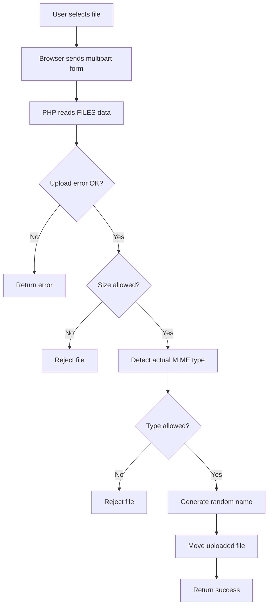

# File Upload

## Table of Contents

- [1. Overview](#1-overview)
- [2. Upload Form](#2-upload-form)
- [3. Understanding `$_FILES`](#3-understanding-_files)
- [4. Secure Upload Workflow](#4-secure-upload-workflow)
- [5. Complete Upload Function](#5-complete-upload-function)
- [6. Multiple Files](#6-multiple-files)
- [7. Production Security](#7-production-security)
- [8. Common Mistakes](#8-common-mistakes)
- [9. Practice](#9-practice)
- [10. Official Resources](#10-official-resources)

---

## 1. Overview

Uploaded files are untrusted input. Validate their upload status, size, actual MIME type, destination, and stored filename.



---

## 2. Upload Form

The form must use `multipart/form-data`:

```html
<form method="post" action="upload.php" enctype="multipart/form-data">
    <label for="document">Choose a document</label>

    <input
        id="document"
        name="document"
        type="file"
        accept=".pdf,.jpg,.jpeg,.png"
        required
    >

    <button type="submit">Upload</button>
</form>
```

The `accept` attribute improves the browser interface, but it is not a server-side security check.

---

## 3. Understanding `$_FILES`

```php
<?php

$file = $_FILES['document'] ?? null;
```

| Field | Meaning | Trust level |
|---|---|---|
| `name` | Client-provided filename | Untrusted |
| `type` | Client-provided MIME type | Untrusted |
| `tmp_name` | Temporary server path | Validate |
| `error` | Upload status code | Check strictly |
| `size` | File size in bytes | Validate |

Never trust the original name or client-provided MIME type.

---

## 4. Secure Upload Workflow

A safe upload should:

1. Validate the expected `$_FILES` structure.
2. Check the upload error code.
3. Validate the file size.
4. Confirm it is an HTTP upload with `is_uploaded_file()`.
5. Detect the actual MIME type with `finfo`.
6. Use a strict MIME allowlist.
7. Create a safe storage directory.
8. Generate a random server-side filename.
9. Move the file with `move_uploaded_file()`.
10. Store only safe metadata.

---

## 5. Complete Upload Function

```php
<?php

declare(strict_types=1);

function uploadDocument(array $file, string $uploadDirectory): string
{
    if (!isset($file['error'], $file['size'], $file['tmp_name'])) {
        throw new InvalidArgumentException('Invalid upload structure.');
    }

    if (!is_int($file['error']) || !is_int($file['size'])) {
        throw new InvalidArgumentException('Invalid upload values.');
    }

    if ($file['error'] !== UPLOAD_ERR_OK) {
        throw new RuntimeException(
            match ($file['error']) {
                UPLOAD_ERR_INI_SIZE,
                UPLOAD_ERR_FORM_SIZE => 'The file is too large.',
                UPLOAD_ERR_PARTIAL => 'The file was partially uploaded.',
                UPLOAD_ERR_NO_FILE => 'No file was uploaded.',
                UPLOAD_ERR_NO_TMP_DIR => 'Temporary directory is missing.',
                UPLOAD_ERR_CANT_WRITE => 'The server could not write the file.',
                UPLOAD_ERR_EXTENSION => 'A PHP extension stopped the upload.',
                default => 'Unknown upload error.',
            }
        );
    }

    $maximumSize = 5 * 1024 * 1024;

    if ($file['size'] <= 0 || $file['size'] > $maximumSize) {
        throw new RuntimeException('The file must be between 1 byte and 5 MB.');
    }

    if (!is_uploaded_file($file['tmp_name'])) {
        throw new RuntimeException('Invalid HTTP upload.');
    }

    $finfo = new finfo(FILEINFO_MIME_TYPE);
    $mimeType = $finfo->file($file['tmp_name']);

    if ($mimeType === false) {
        throw new RuntimeException('Could not detect the file type.');
    }

    $allowedTypes = [
        'application/pdf' => 'pdf',
        'image/jpeg' => 'jpg',
        'image/png' => 'png',
    ];

    if (!isset($allowedTypes[$mimeType])) {
        throw new RuntimeException('Unsupported file type.');
    }

    if (!is_dir($uploadDirectory)) {
        $created = mkdir($uploadDirectory, 0775, true);

        if (!$created && !is_dir($uploadDirectory)) {
            throw new RuntimeException('Could not create upload directory.');
        }
    }

    if (!is_writable($uploadDirectory)) {
        throw new RuntimeException('The upload directory is not writable.');
    }

    $storedName = bin2hex(random_bytes(16))
        . '.'
        . $allowedTypes[$mimeType];

    $destination = $uploadDirectory
        . DIRECTORY_SEPARATOR
        . $storedName;

    if (!move_uploaded_file($file['tmp_name'], $destination)) {
        throw new RuntimeException('Could not save the uploaded file.');
    }

    return $storedName;
}
```

Usage:

```php
<?php

if (($_SERVER['REQUEST_METHOD'] ?? '') === 'POST') {
    try {
        $storedName = uploadDocument(
            $_FILES['document'] ?? [],
            dirname(__DIR__) . '/storage/uploads'
        );

        echo htmlspecialchars($storedName, ENT_QUOTES, 'UTF-8');
    } catch (Throwable $exception) {
        http_response_code(400);

        echo htmlspecialchars(
            $exception->getMessage(),
            ENT_QUOTES | ENT_SUBSTITUTE,
            'UTF-8'
        );
    }
}
```

---

## 6. Multiple Files

HTML:

```html
<input type="file" name="documents[]" multiple>
```

Normalize the nested upload structure:

```php
<?php

function normalizeUploadedFiles(array $files): array
{
    if (!isset($files['name']) || !is_array($files['name'])) {
        return [];
    }

    $normalized = [];

    foreach (array_keys($files['name']) as $index) {
        $normalized[] = [
            'name' => $files['name'][$index] ?? '',
            'type' => $files['type'][$index] ?? '',
            'tmp_name' => $files['tmp_name'][$index] ?? '',
            'error' => $files['error'][$index] ?? UPLOAD_ERR_NO_FILE,
            'size' => $files['size'][$index] ?? 0,
        ];
    }

    return $normalized;
}
```

Validate each normalized file separately.

---

## 7. Production Security

- Store uploads outside the public web root.
- Generate random storage names.
- Detect MIME type using `finfo`.
- Limit file size and number of files.
- Allow only required MIME types.
- Disable script execution in upload directories.
- Authorize every download.
- Consider malware scanning and image re-encoding.
- Apply quotas, rate limits, and audit logs.
- Never execute uploaded content.

---

## 8. Common Mistakes

- Trusting the filename extension.
- Trusting `$_FILES['type']`.
- Saving the original filename directly.
- Storing uploads inside an executable public directory.
- Checking only the HTML `accept` attribute.
- Forgetting `enctype="multipart/form-data"`.
- Ignoring upload error codes.
- Failing to limit file size.
- Allowing double extensions such as `file.php.jpg` to determine behavior.

---

## 9. Practice

Build an image uploader with these rules:

- Maximum size: 3 MB.
- Allowed MIME types: JPEG and PNG.
- Random stored filename.
- Storage outside `public/`.
- Safe success and error output.

### Checklist

- [ ] I understand the `$_FILES` structure.
- [ ] I check upload errors strictly.
- [ ] I detect actual MIME types.
- [ ] I generate server-side filenames.
- [ ] I store uploads outside the public directory.

---

## 10. Official Resources

- [PHP file uploads](https://www.php.net/manual/en/features.file-upload.php)
- [Upload error codes](https://www.php.net/manual/en/features.file-upload.errors.php)
- [`move_uploaded_file()`](https://www.php.net/manual/en/function.move-uploaded-file.php)
- [`is_uploaded_file()`](https://www.php.net/manual/en/function.is-uploaded-file.php)
- [Fileinfo extension](https://www.php.net/manual/en/book.fileinfo.php)
