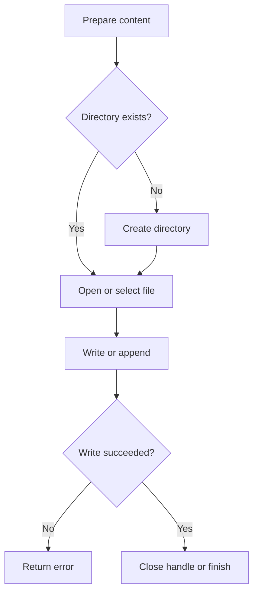

# File Write

## Table of Contents

- [1. Overview](#1-overview)
- [2. Create Directories](#2-create-directories)
- [3. `file_put_contents()`](#3-file_put_contents)
- [4. Append and Lock](#4-append-and-lock)
- [5. `fopen()` and `fwrite()`](#5-fopen-and-fwrite)
- [6. Write JSON](#6-write-json)
- [7. Common Mistakes](#7-common-mistakes)
- [8. Best Practices](#8-best-practices)
- [9. Practice](#9-practice)
- [10. Official Resources](#10-official-resources)

---

## 1. Overview

Writing files requires a valid path, correct permissions, error handling, and sometimes locking.



---

## 2. Create Directories

```php
<?php

$directory = __DIR__ . '/storage/data';

if (!is_dir($directory)) {
    $created = mkdir($directory, 0775, true);

    if (!$created && !is_dir($directory)) {
        throw new RuntimeException('Could not create directory.');
    }
}
```

Avoid using `0777` as a default fix. Use the minimum permissions required by the server.

---

## 3. `file_put_contents()`

```php
<?php

$filePath = __DIR__ . '/storage/data/message.txt';
$content = 'Hello from PHP!' . PHP_EOL;

$bytesWritten = file_put_contents($filePath, $content);

if ($bytesWritten === false) {
    throw new RuntimeException('Could not write the file.');
}

echo "Wrote {$bytesWritten} bytes.";
```

By default, existing content is replaced.

---

## 4. Append and Lock

```php
<?php

$logFile = __DIR__ . '/storage/logs/app.log';
$line = date('c') . ' Application started' . PHP_EOL;

$result = file_put_contents(
    $logFile,
    $line,
    FILE_APPEND | LOCK_EX
);

if ($result === false) {
    throw new RuntimeException('Could not write the log.');
}
```

- `FILE_APPEND` adds content at the end.
- `LOCK_EX` requests an exclusive write lock.

For high-volume concurrent data, use a database instead of a plain file.

---

## 5. `fopen()` and `fwrite()`

```php
<?php

$handle = fopen(
    __DIR__ . '/storage/data/output.txt',
    'ab'
);

if ($handle === false) {
    throw new RuntimeException('Could not open the file.');
}

try {
    $bytesWritten = fwrite(
        $handle,
        'New line' . PHP_EOL
    );

    if ($bytesWritten === false) {
        throw new RuntimeException('Could not write the file.');
    }
} finally {
    fclose($handle);
}
```

Important modes:

| Mode | Behavior |
|---|---|
| `w` | Truncates existing content |
| `a` | Appends to the end |
| `x` | Creates a new file and fails if it exists |
| `c` | Opens for writing without automatic truncation |

---

## 6. Write JSON

```php
<?php

$data = [
    'name' => 'PHP Application',
    'enabled' => true,
    'updated_at' => (new DateTimeImmutable())->format(DATE_ATOM),
];

$json = json_encode(
    $data,
    JSON_PRETTY_PRINT
    | JSON_UNESCAPED_SLASHES
    | JSON_THROW_ON_ERROR
);

$result = file_put_contents(
    __DIR__ . '/storage/data/app.json',
    $json . PHP_EOL,
    LOCK_EX
);

if ($result === false) {
    throw new RuntimeException('Could not save JSON.');
}
```

---

## 7. Common Mistakes

- Ignoring a `false` return value.
- Accidentally truncating a file with mode `w`.
- Writing to a missing or non-writable directory.
- Using `0777` instead of fixing ownership and permissions correctly.
- Allowing users to control the destination path.
- Writing shared data without locking.
- Using a file as a replacement for a database when queries or transactions are needed.

---

## 8. Best Practices

- Build paths from `__DIR__` or a defined project root.
- Create required directories explicitly.
- Check every write result strictly.
- Use `FILE_APPEND | LOCK_EX` for simple shared logs.
- Generate JSON with `JSON_THROW_ON_ERROR`.
- Store logs and data outside the public web root.
- Rotate large log files.
- Use a database for concurrent structured application data.

---

## 9. Practice

Append a timestamped log entry:

```php
<?php

$entry = sprintf(
    "[%s] User opened the page%s",
    (new DateTimeImmutable())->format(DATE_ATOM),
    PHP_EOL
);

$result = file_put_contents(
    __DIR__ . '/storage/logs/app.log',
    $entry,
    FILE_APPEND | LOCK_EX
);

if ($result === false) {
    throw new RuntimeException('Could not write log.');
}
```

### Checklist

- [ ] I can create nested directories.
- [ ] I understand overwrite and append behavior.
- [ ] I can write through a file stream.
- [ ] I can save JSON safely.
- [ ] I know when a database is a better choice.

---

## 10. Official Resources

- [`file_put_contents()`](https://www.php.net/manual/en/function.file-put-contents.php)
- [`fopen()`](https://www.php.net/manual/en/function.fopen.php)
- [`fwrite()`](https://www.php.net/manual/en/function.fwrite.php)
- [`mkdir()`](https://www.php.net/manual/en/function.mkdir.php)
- [PHP filesystem functions](https://www.php.net/manual/en/book.filesystem.php)
