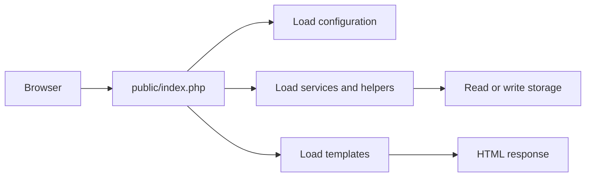

# Include / Require and Application Structure

## Table of Contents

- [1. Overview](#1-overview)
- [2. Recommended Project Structure](#2-recommended-project-structure)
- [3. Include and Require Comparison](#3-include-and-require-comparison)
- [4. Using `include`](#4-using-include)
- [5. Using `require`](#5-using-require)
- [6. Using `_once`](#6-using-_once)
- [7. Reliable Paths with `__DIR__`](#7-reliable-paths-with-__dir__)
- [8. Reusable Templates](#8-reusable-templates)
- [9. Security](#9-security)
- [10. Common Mistakes](#10-common-mistakes)
- [11. Practice](#11-practice)
- [12. Official Resources](#12-official-resources)

---

## 1. Overview

PHP applications become easier to maintain when configuration, application logic, templates, storage, and public entry points are separated.



---

## 2. Recommended Project Structure

```text
php-file-app/
├── public/
│   ├── index.php
│   └── upload.php
├── src/
│   ├── FileService.php
│   └── helpers.php
├── templates/
│   ├── header.php
│   └── footer.php
├── config/
│   └── app.php
├── storage/
│   ├── data/
│   ├── logs/
│   └── uploads/
└── README.md
```

| Folder | Purpose |
|---|---|
| `public/` | Files accessible through the web server |
| `src/` | Classes, helpers, and application logic |
| `templates/` | Reusable HTML and PHP templates |
| `config/` | Application configuration |
| `storage/` | Data, logs, and uploaded files |

Only `public/` should normally be exposed by the web server.

---

## 3. Include and Require Comparison

| Statement | Missing file behavior | Loads once |
|---|---|---:|
| `include` | Warning; script usually continues | No |
| `require` | Fatal error; script stops | No |
| `include_once` | Warning; script usually continues | Yes |
| `require_once` | Fatal error; script stops | Yes |

Use `require` for files the application cannot run without. Use `include` for optional presentation fragments.

---

## 4. Using `include`

```php
<?php

include __DIR__ . '/templates/sidebar.php';

echo '<main>Main page content</main>';
```

If the sidebar is missing, PHP reports a warning but usually continues.

---

## 5. Using `require`

```php
<?php

$config = require __DIR__ . '/config/app.php';
```

`config/app.php`:

```php
<?php

return [
    'name' => 'PHP File Application',
    'timezone' => 'Asia/Ho_Chi_Minh',
];
```

A required PHP file can return a value.

---

## 6. Using `_once`

Use `require_once` or `include_once` for files that define functions, classes, interfaces, or constants.

```php
<?php

require_once __DIR__ . '/src/helpers.php';
require_once __DIR__ . '/src/helpers.php';
```

The file runs only once and avoids errors such as:

```text
Cannot redeclare function...
```

---

## 7. Reliable Paths with `__DIR__`

Risky:

```php
require '../config/app.php';
```

Safer:

```php
require dirname(__DIR__) . '/config/app.php';
```

Define a project root when useful:

```php
<?php

define('BASE_PATH', dirname(__DIR__));

$config = require BASE_PATH . '/config/app.php';
```

`__DIR__` always points to the directory containing the current PHP file.

---

## 8. Reusable Templates

`templates/header.php`:

```php
<?php

$pageTitle = $pageTitle ?? 'My PHP Application';
?>
<!doctype html>
<html lang="en">
<head>
    <meta charset="UTF-8">
    <meta name="viewport" content="width=device-width, initial-scale=1">
    <title><?= htmlspecialchars($pageTitle, ENT_QUOTES, 'UTF-8') ?></title>
</head>
<body>
<header>
    <h1><?= htmlspecialchars($pageTitle, ENT_QUOTES, 'UTF-8') ?></h1>
</header>
```

`templates/footer.php`:

```php
<footer>
    <p>&copy; <?= date('Y') ?> My PHP Application</p>
</footer>
</body>
</html>
```

Page file:

```php
<?php

$pageTitle = 'Home';

require dirname(__DIR__) . '/templates/header.php';
?>

<main>
    <p>Welcome to the application.</p>
</main>

<?php require dirname(__DIR__) . '/templates/footer.php'; ?>
```

---

## 9. Security

Never build an include path directly from user input.

Unsafe:

```php
$page = $_GET['page'] ?? 'home';
include $page . '.php';
```

Use an allowlist:

```php
<?php

$pages = [
    'home' => __DIR__ . '/pages/home.php',
    'about' => __DIR__ . '/pages/about.php',
];

$page = $_GET['page'] ?? 'home';

if (!isset($pages[$page])) {
    http_response_code(404);
    exit('Page not found.');
}

require $pages[$page];
```

---

## 10. Common Mistakes

- Using fragile relative paths.
- Using `include` for critical configuration.
- Loading the same function file multiple times without `_once`.
- Exposing configuration and storage inside `public/`.
- Using a user-controlled file path in `include` or `require`.
- Mixing business logic, storage, and HTML in one large entry file.

---

## 11. Practice

Create this structure:

```text
templates/header.php
templates/footer.php
public/about.php
config/app.php
```

Use `require` to assemble the page and load its configuration.

### Checklist

- [ ] I understand the difference between `include` and `require`.
- [ ] I can use `require_once` for definitions.
- [ ] I can build reliable paths with `__DIR__`.
- [ ] I keep sensitive files outside `public/`.
- [ ] I use an allowlist for selectable pages.

---

## 12. Official Resources

- [PHP include](https://www.php.net/manual/en/function.include.php)
- [PHP require](https://www.php.net/manual/en/function.require.php)
- [PHP include_once](https://www.php.net/manual/en/function.include-once.php)
- [PHP require_once](https://www.php.net/manual/en/function.require-once.php)
