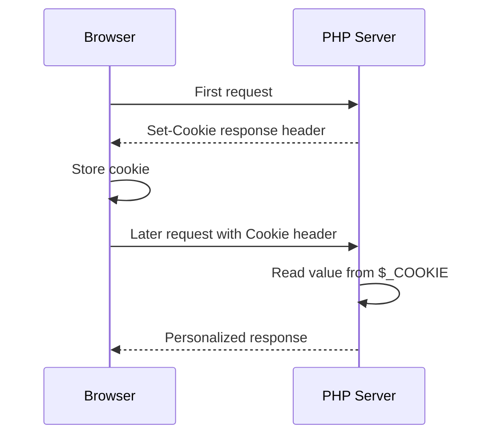
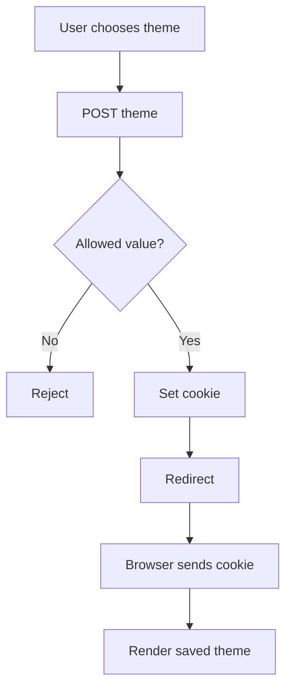
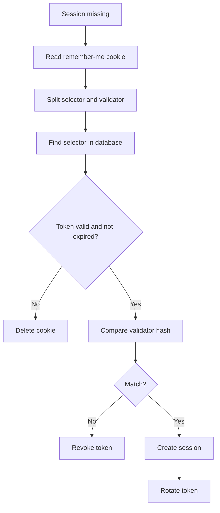

# Cookies

## Table of Contents

- [1. Overview](#1-overview)
- [2. How Cookies Work](#2-how-cookies-work)
- [3. Create a Cookie](#3-create-a-cookie)
- [4. Read and Validate Cookies](#4-read-and-validate-cookies)
- [5. Update and Delete Cookies](#5-update-and-delete-cookies)
- [6. Cookie Options](#6-cookie-options)
- [7. Theme Preference Example](#7-theme-preference-example)
- [8. Remember-Me Tokens](#8-remember-me-tokens)
- [9. Security Rules](#9-security-rules)
- [10. Common Mistakes](#10-common-mistakes)
- [11. Practice Exercises](#11-practice-exercises)
- [12. Official Documentation](#12-official-documentation)

---

## 1. Overview

HTTP is stateless, so the server does not automatically remember earlier requests from the same browser.

A cookie is a small name-value pair stored by the browser and sent back with later matching requests.

Common uses:

- Theme and language preferences
- Consent choices
- Anonymous identifiers
- Session IDs
- Secure remember-me tokens

Do not store passwords, trusted roles, private keys, or other sensitive authorization data directly in cookies.

---

## 2. How Cookies Work



Cookies are sent through HTTP headers. Therefore, `setcookie()` must run before normal output.

---

## 3. Create a Cookie

```php
<?php

setcookie(
    'theme',
    'dark',
    [
        'expires' => time() + 60 * 60 * 24 * 30,
        'path' => '/',
        'secure' => true,
        'httponly' => true,
        'samesite' => 'Lax',
    ]
);
```

This cookie:

- Is named `theme`
- Stores `dark`
- Expires after 30 days
- Is available across the site
- Is sent only over HTTPS
- Cannot normally be read by JavaScript
- Uses `SameSite=Lax`

`setcookie()` does not immediately add the new value to `$_COOKIE` during the same request. The browser sends it on a later request.

---

## 4. Read and Validate Cookies

```php
<?php

$theme = $_COOKIE['theme'] ?? 'light';
```

Cookie values are user-controlled. Validate them with an allowlist:

```php
<?php

$allowedThemes = ['light', 'dark'];
$theme = $_COOKIE['theme'] ?? 'light';

if (!in_array($theme, $allowedThemes, true)) {
    $theme = 'light';
}
```

Never use a cookie as trusted proof that a user is an administrator.

---

## 5. Update and Delete Cookies

### Update

Set the same cookie name again:

```php
<?php

setcookie(
    'theme',
    'light',
    [
        'expires' => time() + 60 * 60 * 24 * 30,
        'path' => '/',
        'secure' => true,
        'httponly' => true,
        'samesite' => 'Lax',
    ]
);
```

Use the same name, path, and domain as the original cookie.

### Delete

Expire it in the past:

```php
<?php

setcookie(
    'theme',
    '',
    [
        'expires' => time() - 3600,
        'path' => '/',
        'secure' => true,
        'httponly' => true,
        'samesite' => 'Lax',
    ]
);

unset($_COOKIE['theme']);
```

`unset()` only changes the current PHP array. The expired response cookie tells the browser to delete its stored value.

---

## 6. Cookie Options

| Option | Purpose |
|---|---|
| `expires` | Expiration timestamp |
| `path` | URL path scope |
| `domain` | Domain scope |
| `secure` | Send only through HTTPS |
| `httponly` | Block JavaScript access |
| `samesite` | Control cross-site sending |

### SameSite values

| Value | Behavior |
|---|---|
| `Strict` | Strong cross-site restriction |
| `Lax` | Balanced default for many applications |
| `None` | Allows cross-site sending and requires `Secure` |

Recommended general-purpose settings:

```php
[
    'secure' => true,
    'httponly' => true,
    'samesite' => 'Lax',
]
```

---

## 7. Theme Preference Example

```php
<?php

declare(strict_types=1);

$allowedThemes = ['light', 'dark'];

if (($_SERVER['REQUEST_METHOD'] ?? '') === 'POST') {
    $submittedTheme = $_POST['theme'] ?? '';

    if (in_array($submittedTheme, $allowedThemes, true)) {
        setcookie(
            'theme',
            $submittedTheme,
            [
                'expires' => time() + 60 * 60 * 24 * 365,
                'path' => '/',
                'secure' => isset($_SERVER['HTTPS']),
                'httponly' => true,
                'samesite' => 'Lax',
            ]
        );

        header('Location: ' . $_SERVER['PHP_SELF'], true, 303);
        exit;
    }
}

$theme = $_COOKIE['theme'] ?? 'light';

if (!in_array($theme, $allowedThemes, true)) {
    $theme = 'light';
}
?>
<!doctype html>
<html lang="en">
<head>
    <meta charset="UTF-8">
    <title>Theme Preference</title>
</head>
<body class="<?= htmlspecialchars($theme, ENT_QUOTES, 'UTF-8') ?>">
    <p>Current theme: <?= htmlspecialchars($theme, ENT_QUOTES, 'UTF-8') ?></p>

    <form method="post">
        <select name="theme">
            <option value="light">Light</option>
            <option value="dark">Dark</option>
        </select>

        <button type="submit">Save Theme</button>
    </form>
</body>
</html>
```



---

## 8. Remember-Me Tokens

Never store a user ID or password as a trusted remember-me cookie.

Safer design:

1. Generate a random selector and validator.
2. Store the selector and a hash of the validator in the database.
3. Send the raw token in a secure cookie.
4. Verify it when the normal session is missing.
5. Rotate the token after successful use.
6. Revoke it during logout or password reset.

```php
<?php

$selector = bin2hex(random_bytes(9));
$validator = bin2hex(random_bytes(32));
$validatorHash = hash('sha256', $validator);
$cookieValue = $selector . ':' . $validator;
```



Use a mature authentication library or framework implementation in production.

---

## 9. Security Rules

- Use HTTPS in production.
- Enable `Secure`, `HttpOnly`, and an appropriate `SameSite` value.
- Validate every cookie value.
- Keep cookie contents small.
- Do not expose session IDs in URLs or logs.
- Do not store passwords or trusted authorization roles in cookies.
- Use random, revocable tokens for remember-me authentication.
- Treat `HttpOnly` as one defense, not complete XSS protection.

---

## 10. Common Mistakes

### Output before `setcookie()`

```php
<?php

echo 'Hello';
setcookie('theme', 'dark');
```

Send the cookie first.

### Trusting a role cookie

```php
<?php

$role = $_COOKIE['role'] ?? 'guest';
```

This must not control authorization.

### SameSite=None without Secure

Modern browsers require `Secure` when using `SameSite=None`.

### Saving passwords

Never do this:

```php
setcookie('password', $password);
```

---

## 11. Practice Exercises

1. Create a language cookie accepting only `en` and `vi`.
2. Add a cookie consent preference.
3. Create a theme selector using Post-Redirect-Get.
4. Delete the preference cookie with the same path and domain.
5. Design the database columns required for a remember-me token.

---

## 12. Official Documentation

- [PHP Cookies](https://www.php.net/manual/en/features.cookies.php)
- [`setcookie()`](https://www.php.net/manual/en/function.setcookie.php)
- [`$_COOKIE`](https://www.php.net/manual/en/reserved.variables.cookies.php)
- [`random_bytes()`](https://www.php.net/manual/en/function.random-bytes.php)
- [`hash_equals()`](https://www.php.net/manual/en/function.hash-equals.php)
- [Download PHP](https://www.php.net/downloads.php)
