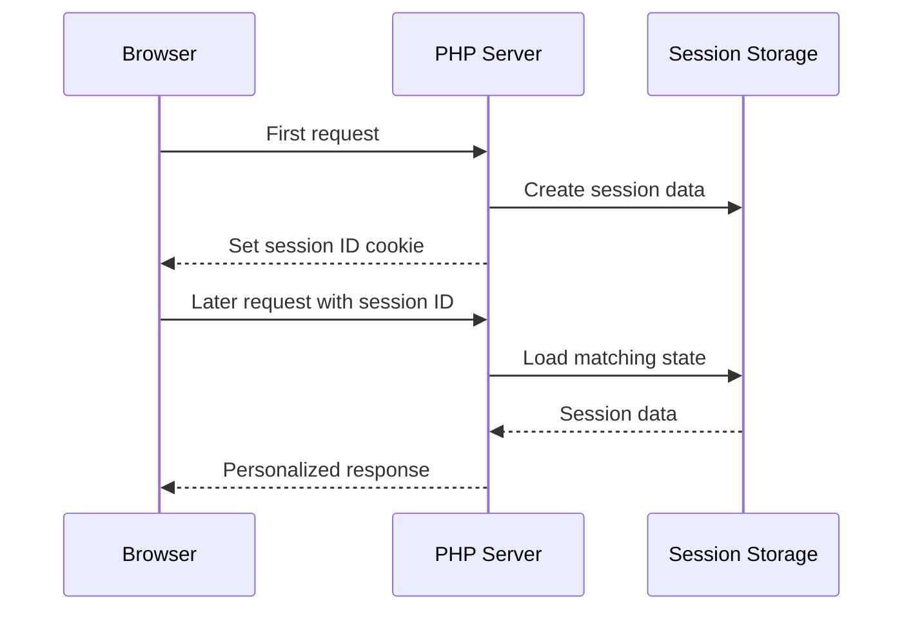
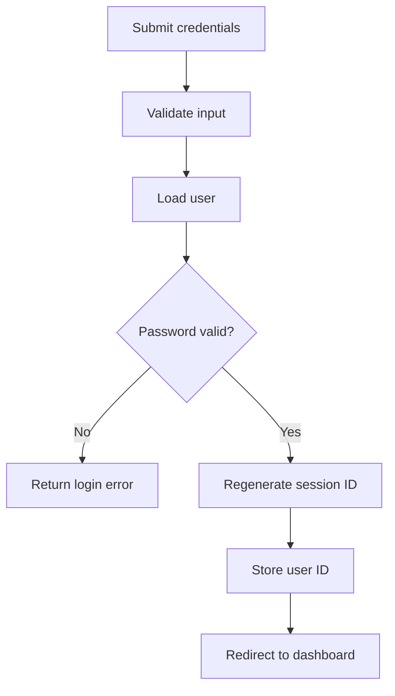

# Sessions

## Table of Contents

- [1. Overview](#1-overview)
- [2. Start and Configure a Session](#2-start-and-configure-a-session)
- [3. Store, Read, and Remove Data](#3-store-read-and-remove-data)
- [4. Destroy a Session](#4-destroy-a-session)
- [5. Regenerate the Session ID](#5-regenerate-the-session-id)
- [6. Login State](#6-login-state)
- [7. Flash Messages](#7-flash-messages)
- [8. Shopping Cart State](#8-shopping-cart-state)
- [9. Session Timeouts](#9-session-timeouts)
- [10. CSRF Tokens](#10-csrf-tokens)
- [11. Security Considerations](#11-security-considerations)
- [12. Mini Application Structure](#12-mini-application-structure)
- [13. Common Mistakes](#13-common-mistakes)
- [14. Best Practices](#14-best-practices)
- [15. Practice Exercises](#15-practice-exercises)
- [16. Official Documentation](#16-official-documentation)

---

## 1. Overview

A PHP session stores user state on the server. The browser normally stores only a session ID cookie, commonly named `PHPSESSID`.

Typical session uses:

- Login state
- CSRF tokens
- Flash messages
- Shopping carts
- Multi-step forms
- Temporary workflow data



---

## 2. Start and Configure a Session

Call `session_start()` before reading or writing `$_SESSION`.

```php
<?php

session_start();
```

A safer bootstrap:

```php
<?php

declare(strict_types=1);

ini_set('session.use_strict_mode', '1');
ini_set('session.use_only_cookies', '1');

session_name('APP_SESSION');

session_start([
    'cookie_lifetime' => 0,
    'cookie_path' => '/',
    'cookie_secure' => isset($_SERVER['HTTPS']),
    'cookie_httponly' => true,
    'cookie_samesite' => 'Lax',
]);
```

Important settings:

| Setting | Purpose |
|---|---|
| `session.use_strict_mode` | Reject uninitialized session IDs |
| `session.use_only_cookies` | Prevent URL-based session IDs |
| `session.cookie_secure` | Send cookie only through HTTPS |
| `session.cookie_httponly` | Block JavaScript access |
| `session.cookie_samesite` | Control cross-site cookie behavior |
| `session.gc_maxlifetime` | Session data lifetime |
| `session.name` | Session cookie name |

---

## 3. Store, Read, and Remove Data

### Store values

```php
<?php

session_start();

$_SESSION['user_id'] = 123;
$_SESSION['username'] = 'Alan';
$_SESSION['role'] = 'developer';
```

Keep session data small. Store identifiers instead of complete large database records.

### Read values

```php
<?php

session_start();

$userId = $_SESSION['user_id'] ?? null;
$username = $_SESSION['username'] ?? 'Guest';
```

### Remove one value

```php
unset($_SESSION['cart']);
```

### Remove all values

```php
$_SESSION = [];
```

or:

```php
session_unset();
```

`session_unset()` removes variables but does not destroy the session itself.

---

## 4. Destroy a Session

A complete logout should clear:

1. The `$_SESSION` array
2. The browser session cookie
3. The server-side session

```php
<?php

declare(strict_types=1);

session_start();

$_SESSION = [];

if (ini_get('session.use_cookies')) {
    $parameters = session_get_cookie_params();

    setcookie(
        session_name(),
        '',
        [
            'expires' => time() - 42000,
            'path' => $parameters['path'],
            'domain' => $parameters['domain'],
            'secure' => $parameters['secure'],
            'httponly' => $parameters['httponly'],
            'samesite' => $parameters['samesite'] ?? 'Lax',
        ]
    );
}

session_destroy();

header('Location: /login.php', true, 303);
exit;
```

---

## 5. Regenerate the Session ID

Regenerate after authentication or privilege changes:

```php
<?php

session_start();
session_regenerate_id(true);
$_SESSION['user_id'] = 123;
```

Use it:

- After login
- After privilege elevation
- After important account-security changes
- Periodically for long-lived sessions when appropriate

This reduces session fixation risk.

---

## 6. Login State



### Login handler

```php
<?php

declare(strict_types=1);

session_start([
    'cookie_httponly' => true,
    'cookie_secure' => isset($_SERVER['HTTPS']),
    'cookie_samesite' => 'Lax',
    'use_strict_mode' => true,
]);

$email = trim($_POST['email'] ?? '');
$password = $_POST['password'] ?? '';

if (filter_var($email, FILTER_VALIDATE_EMAIL) === false) {
    http_response_code(422);
    exit('Enter a valid email address.');
}

if (!is_string($password) || $password === '') {
    http_response_code(422);
    exit('Password is required.');
}

/* Replace with a database query. */
$user = [
    'id' => 123,
    'email' => 'alan@example.com',
    'password_hash' => password_hash('secret123', PASSWORD_DEFAULT),
    'role' => 'developer',
];

if (
    $user['email'] !== $email
    || !password_verify($password, $user['password_hash'])
) {
    http_response_code(401);
    exit('Invalid email or password.');
}

session_regenerate_id(true);

$_SESSION['user_id'] = $user['id'];
$_SESSION['role'] = $user['role'];
$_SESSION['authenticated_at'] = time();

header('Location: /dashboard.php', true, 303);
exit;
```

### Protected page

```php
<?php

session_start();

$userId = $_SESSION['user_id'] ?? null;

if (!is_int($userId)) {
    header('Location: /login.php', true, 303);
    exit;
}
```

Authentication and authorization are different. A logged-in user must still pass server-side permission checks.

---

## 7. Flash Messages

A flash message is stored for one future request.

### Set

```php
<?php

session_start();

$_SESSION['flash']['success'] = 'Your profile was updated.';

header('Location: /profile.php', true, 303);
exit;
```

### Read and remove

```php
<?php

session_start();

$message = $_SESSION['flash']['success'] ?? null;
unset($_SESSION['flash']['success']);
```

Reusable helpers:

```php
<?php

function setFlash(string $type, string $message): void
{
    $_SESSION['flash'][$type] = $message;
}

function getFlash(string $type): ?string
{
    $message = $_SESSION['flash'][$type] ?? null;
    unset($_SESSION['flash'][$type]);

    return is_string($message) ? $message : null;
}
```

Escape flash messages before rendering them in HTML.

---

## 8. Shopping Cart State

```php
<?php

session_start();

$productId = filter_input(INPUT_POST, 'product_id', FILTER_VALIDATE_INT);
$quantity = filter_input(
    INPUT_POST,
    'quantity',
    FILTER_VALIDATE_INT,
    [
        'options' => [
            'min_range' => 1,
            'max_range' => 100,
        ],
    ]
);

if ($productId === false || $productId === null) {
    exit('Invalid product ID.');
}

if ($quantity === false || $quantity === null) {
    exit('Invalid quantity.');
}

$_SESSION['cart'] ??= [];
$_SESSION['cart'][$productId] =
    ($_SESSION['cart'][$productId] ?? 0) + $quantity;
```

Do not trust prices stored in the session or submitted by the browser. Load current prices from the database before calculating an order total.

---

## 9. Session Timeouts

### Idle timeout

```php
<?php

session_start();

$maximumIdleSeconds = 30 * 60;
$lastActivity = $_SESSION['last_activity'] ?? null;

if (
    is_int($lastActivity)
    && time() - $lastActivity > $maximumIdleSeconds
) {
    $_SESSION = [];
    session_destroy();

    header('Location: /login.php?expired=1', true, 303);
    exit;
}

$_SESSION['last_activity'] = time();
```

An absolute timeout can limit total session lifetime even when the user remains active.

---

## 10. CSRF Tokens

Create a token:

```php
<?php

session_start();

$_SESSION['csrf_token'] ??= bin2hex(random_bytes(32));
```

Add it to a form:

```php
<input
    type="hidden"
    name="csrf_token"
    value="<?= htmlspecialchars(
        $_SESSION['csrf_token'],
        ENT_QUOTES | ENT_SUBSTITUTE,
        'UTF-8'
    ) ?>"
>
```

Validate it:

```php
<?php

$submittedToken = $_POST['csrf_token'] ?? '';
$storedToken = $_SESSION['csrf_token'] ?? '';

if (
    !is_string($submittedToken)
    || !is_string($storedToken)
    || $storedToken === ''
    || !hash_equals($storedToken, $submittedToken)
) {
    http_response_code(403);
    exit('Invalid CSRF token.');
}
```

Use CSRF protection for state-changing browser requests.

---

## 11. Security Considerations

### Session fixation

Defense:

```php
session_regenerate_id(true);
```

Also enable strict mode.

### Session hijacking

Reduce risk with:

- HTTPS
- Secure and HttpOnly cookies
- Suitable SameSite settings
- Strong random session IDs
- Session regeneration
- Idle and absolute timeouts
- Logout and token revocation
- XSS prevention
- Server-side authorization checks

### Sensitive data

Avoid storing:

- Passwords
- Private keys
- Payment-card data
- Database credentials
- Large records or files

Session data is server-side, but it can still be exposed through debug output, backups, weak permissions, or a server compromise.

---

## 12. Mini Application Structure

```text
user-state-example/
├── public/
│   ├── index.php
│   ├── login.php
│   ├── dashboard.php
│   └── logout.php
└── src/
    ├── bootstrap.php
    └── helpers.php
```

### `src/bootstrap.php`

```php
<?php

declare(strict_types=1);

ini_set('session.use_strict_mode', '1');
ini_set('session.use_only_cookies', '1');

session_name('USER_STATE_SESSION');

session_start([
    'cookie_lifetime' => 0,
    'cookie_path' => '/',
    'cookie_secure' => isset($_SERVER['HTTPS']),
    'cookie_httponly' => true,
    'cookie_samesite' => 'Lax',
]);
```

### `src/helpers.php`

```php
<?php

declare(strict_types=1);

function escape(string $value): string
{
    return htmlspecialchars(
        $value,
        ENT_QUOTES | ENT_SUBSTITUTE,
        'UTF-8'
    );
}

function requireAuthentication(): int
{
    $userId = $_SESSION['user_id'] ?? null;

    if (!is_int($userId)) {
        header('Location: /login.php', true, 303);
        exit;
    }

    return $userId;
}
```

Run locally:

```bash
php -S localhost:8000 -t public
```

The built-in server is suitable for learning and local development, not production hosting.

---

## 13. Common Mistakes

### Forgetting `session_start()`

`$_SESSION` is not available correctly until the session is started.

### Not regenerating after login

Call:

```php
session_regenerate_id(true);
```

### Using only `session_destroy()`

It does not automatically clear the current array or the browser cookie.

### Storing too much data

Store small identifiers and reload current data when needed.

### Treating HttpOnly as complete XSS protection

It protects cookie access from JavaScript, but malicious scripts may still perform actions as the user.

### Trusting session role forever

Reload permissions when necessary, especially after account or role changes.

---

## 14. Best Practices

- Start sessions in one bootstrap file.
- Use strict mode and cookies only.
- Use `Secure`, `HttpOnly`, and suitable `SameSite` settings.
- Regenerate the ID after login or privilege changes.
- Store small trusted identifiers, not full records.
- Add idle and absolute timeouts.
- Protect state-changing forms with CSRF tokens.
- Clear the array, cookie, and server session during logout.
- Use HTTPS.
- Use shared session storage such as Redis for multi-server deployments.
- Do not expose session IDs in URLs, logs, HTML, or analytics.

---

## 15. Practice Exercises

1. Create a visit counter stored in the session.
2. Build a flash-message helper.
3. Protect a page using `user_id`.
4. Add a 15-minute idle timeout.
5. Store cart quantities by product ID.
6. Add and validate a CSRF token.
7. Implement complete logout behavior.

---

## 16. Official Documentation

- [PHP Sessions](https://www.php.net/manual/en/book.session.php)
- [`session_start()`](https://www.php.net/manual/en/function.session-start.php)
- [`$_SESSION`](https://www.php.net/manual/en/reserved.variables.session.php)
- [Session Security](https://www.php.net/manual/en/session.security.php)
- [Session Configuration](https://www.php.net/manual/en/session.configuration.php)
- [`session_regenerate_id()`](https://www.php.net/manual/en/function.session-regenerate-id.php)
- [`session_destroy()`](https://www.php.net/manual/en/function.session-destroy.php)
- [Password Hashing](https://www.php.net/manual/en/book.password.php)
- [`hash_equals()`](https://www.php.net/manual/en/function.hash-equals.php)
- [Download PHP](https://www.php.net/downloads.php)
