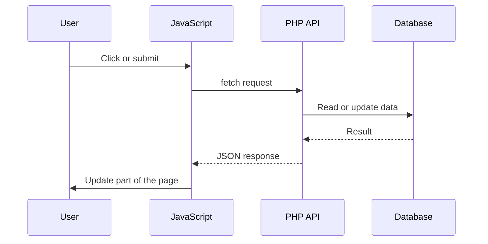

# AJAX and the Fetch API

## Table of Contents

- [1. Overview](#1-overview)
- [2. AJAX Request Flow](#2-ajax-request-flow)
- [3. GET Requests with `fetch()`](#3-get-requests-with-fetch)
- [4. POST JSON with `fetch()`](#4-post-json-with-fetch)
- [5. Submit `FormData`](#5-submit-formdata)
- [6. Reusable Request Helper](#6-reusable-request-helper)
- [7. Loading and Error States](#7-loading-and-error-states)
- [8. Complete Task List Example](#8-complete-task-list-example)
- [9. Security](#9-security)
- [10. Common Mistakes](#10-common-mistakes)
- [11. Best Practices](#11-best-practices)
- [12. Practice Exercises](#12-practice-exercises)
- [13. Official Documentation](#13-official-documentation)
- [14. Summary](#14-summary)

---

## 1. Overview

AJAX means sending HTTP requests from JavaScript without reloading the whole page.

Modern applications normally use the browser `fetch()` API and JSON.

Common uses:

- Search suggestions
- Form submission
- Pagination
- Dashboard updates
- Shopping-cart changes
- Auto-save
- File uploads

---

## 2. AJAX Request Flow



Important rule:

> `fetch()` rejects on network failure, but it does not reject automatically for HTTP errors such as `404` or `500`.

Always check `response.ok`.

---

## 3. GET Requests with `fetch()`

PHP endpoint:

```php
<?php

header('Content-Type: application/json; charset=utf-8');

 echo json_encode([
    'success' => true,
    'data' => [
        ['id' => 1, 'name' => 'Keyboard', 'price' => 50],
        ['id' => 2, 'name' => 'Mouse', 'price' => 25],
    ],
], JSON_THROW_ON_ERROR);
```

JavaScript:

```html
<button id="load-products" type="button">Load Products</button>
<ul id="product-list"></ul>

<script>
const button = document.querySelector('#load-products');
const list = document.querySelector('#product-list');

button.addEventListener('click', async () => {
    try {
        const response = await fetch('/api/products.php', {
            headers: {
                Accept: 'application/json',
            },
        });

        const result = await response.json();

        if (!response.ok) {
            throw new Error(
                result.error?.message ?? 'Request failed.'
            );
        }

        list.replaceChildren();

        for (const product of result.data) {
            const item = document.createElement('li');
            item.textContent = `${product.name}: $${product.price}`;
            list.append(item);
        }
    } catch (error) {
        console.error(error);
        alert(error.message);
    }
});
</script>
```

Use `textContent` instead of `innerHTML` for untrusted API values.

---

## 4. POST JSON with `fetch()`

```javascript
const response = await fetch('/api/users.php', {
    method: 'POST',
    headers: {
        'Content-Type': 'application/json',
        Accept: 'application/json',
    },
    body: JSON.stringify({
        name: 'Alan',
        email: 'alan@example.com',
    }),
});

const result = await response.json();

if (!response.ok) {
    throw new Error(
        result.error?.message ?? 'Could not create user.'
    );
}
```

PHP reads JSON from:

```php
file_get_contents('php://input')
```

not from `$_POST`.

---

## 5. Submit `FormData`

Use `FormData` for regular fields and file uploads.

```html
<form id="profile-form">
    <input name="name" type="text" required>
    <input name="avatar" type="file" accept="image/*">
    <button type="submit">Save</button>
</form>

<script>
const form = document.querySelector('#profile-form');

form.addEventListener('submit', async (event) => {
    event.preventDefault();

    const formData = new FormData(form);

    const response = await fetch('/api/profile.php', {
        method: 'POST',
        headers: {
            Accept: 'application/json',
        },
        body: formData,
    });

    const result = await response.json();

    if (!response.ok) {
        throw new Error(
            result.error?.message ?? 'Submission failed.'
        );
    }
});
</script>
```

Do not manually set:

```javascript
'Content-Type': 'multipart/form-data'
```

The browser must add the multipart boundary.

---

## 6. Reusable Request Helper

```javascript
async function requestJson(url, options = {}) {
    const response = await fetch(url, {
        ...options,
        headers: {
            Accept: 'application/json',
            ...options.headers,
        },
    });

    const contentType =
        response.headers.get('content-type') ?? '';

    const result = contentType.includes('application/json')
        ? await response.json()
        : null;

    if (!response.ok) {
        const error = new Error(
            result?.error?.message
            ?? `Request failed with status ${response.status}.`
        );

        error.status = response.status;
        error.response = result;

        throw error;
    }

    return result;
}
```

This helper:

- Sends an `Accept` header.
- Checks the response content type.
- Handles non-success HTTP status codes.
- Preserves structured error details.

---

## 7. Loading and Error States

```javascript
button.disabled = true;
statusElement.textContent = 'Loading...';

try {
    const result = await requestJson('/api/products.php');
    statusElement.textContent = 'Products loaded.';
} catch (error) {
    statusElement.textContent = error.message;
} finally {
    button.disabled = false;
}
```

Good AJAX interfaces should:

- Disable repeated submissions.
- Show progress.
- Display useful validation errors.
- Restore controls in `finally`.
- Handle empty results.
- Preserve keyboard accessibility.

---

## 8. Complete Task List Example

```html
<!doctype html>
<html lang="en">
<head>
    <meta charset="UTF-8">
    <title>AJAX Task List</title>
</head>
<body>
<main>
    <h1>Tasks</h1>

    <form id="task-form">
        <input
            id="title"
            name="title"
            type="text"
            maxlength="200"
            required
        >

        <button id="submit-button" type="submit">
            Add Task
        </button>
    </form>

    <p id="status" role="status"></p>
    <ul id="task-list"></ul>
</main>

<script>
const form = document.querySelector('#task-form');
const titleInput = document.querySelector('#title');
const submitButton = document.querySelector('#submit-button');
const statusElement = document.querySelector('#status');
const taskList = document.querySelector('#task-list');

async function requestJson(url, options = {}) {
    const response = await fetch(url, {
        ...options,
        headers: {
            Accept: 'application/json',
            ...options.headers,
        },
    });

    const contentType =
        response.headers.get('content-type') ?? '';

    const result = contentType.includes('application/json')
        ? await response.json()
        : null;

    if (!response.ok) {
        const error = new Error(
            result?.error?.message
            ?? `Request failed with status ${response.status}.`
        );

        error.response = result;
        throw error;
    }

    return result;
}

function renderTasks(tasks) {
    taskList.replaceChildren();

    if (tasks.length === 0) {
        const item = document.createElement('li');
        item.textContent = 'No tasks yet.';
        taskList.append(item);
        return;
    }

    for (const task of tasks) {
        const item = document.createElement('li');
        item.textContent = task.title;
        taskList.append(item);
    }
}

async function loadTasks() {
    statusElement.textContent = 'Loading tasks...';

    try {
        const result = await requestJson('/api/tasks.php');
        renderTasks(result.data);
        statusElement.textContent = 'Tasks loaded.';
    } catch (error) {
        statusElement.textContent = error.message;
    }
}

form.addEventListener('submit', async (event) => {
    event.preventDefault();

    const title = titleInput.value.trim();

    if (title === '') {
        statusElement.textContent = 'Task title is required.';
        return;
    }

    submitButton.disabled = true;
    statusElement.textContent = 'Creating task...';

    try {
        await requestJson('/api/tasks.php', {
            method: 'POST',
            headers: {
                'Content-Type': 'application/json',
            },
            body: JSON.stringify({ title }),
        });

        form.reset();
        await loadTasks();
    } catch (error) {
        statusElement.textContent =
            error.response?.error?.fields?.title
            ?? error.message;
    } finally {
        submitButton.disabled = false;
    }
});

loadTasks();
</script>
</body>
</html>
```

---

## 9. Security

For state-changing AJAX requests, use:

- Authentication
- Authorization
- CSRF tokens for cookie-based sessions
- Secure cookies
- Appropriate `SameSite` settings
- Prepared SQL statements
- Strict validation
- Request-size limits
- Carefully configured CORS

Never insert untrusted values with `innerHTML` unless they are safely sanitized for that exact context.

---

## 10. Common Mistakes

### Treating every response as successful

Check:

```javascript
response.ok
```

### Always calling `response.json()`

The response may be empty or HTML. Check the content type first.

### Manually setting multipart boundaries

Let the browser set the `Content-Type` for `FormData`.

### Using `innerHTML` for API values

Prefer:

```javascript
element.textContent = value;
```

### Missing loading states

Prevent duplicate requests and show progress.

---

## 11. Best Practices

- Use `fetch()` for modern browser requests.
- Check `response.ok`.
- Inspect the response content type.
- Use `textContent` for untrusted values.
- Use `FormData` for files.
- Keep response formats consistent.
- Disable repeated submissions.
- Show accessible loading and error messages.
- Protect authenticated state changes.

---

## 12. Practice Exercises

### Fetch JSON data

```javascript
async function loadData() {
    const response = await fetch('/api/data.php', {
        headers: {
            Accept: 'application/json',
        },
    });

    const result = await response.json();

    if (!response.ok) {
        throw new Error(
            result.error?.message ?? 'Request failed.'
        );
    }

    console.log(result.data);
}
```

### Submit a JSON form

Create a form that sends a name and email to PHP using `JSON.stringify()`.

### Upload a file

Submit an image through `FormData` without manually setting the multipart content type.

---

## 13. Official Documentation

- [Fetch API](https://developer.mozilla.org/en-US/docs/Web/API/Fetch_API)
- [`fetch()`](https://developer.mozilla.org/en-US/docs/Web/API/Window/fetch)
- [`FormData`](https://developer.mozilla.org/en-US/docs/Web/API/FormData)
- [PHP JSON extension](https://www.php.net/manual/en/book.json.php)

---

## 14. Summary

| Topic | Purpose |
|---|---|
| AJAX | Updates data without a full page reload |
| `fetch()` | Sends modern browser HTTP requests |
| `response.ok` | Checks HTTP success status |
| `FormData` | Sends forms and files |
| `textContent` | Safely inserts plain text |

Recommended defaults:

- Use `fetch()` with JSON.
- Check `response.ok`.
- Use `textContent` for API values.
- Use `FormData` for uploads.
- Handle loading, empty, and error states.
