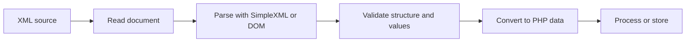

# XML Data Exchange in PHP

## Table of Contents

- [1. Overview](#1-overview)
- [2. XML Fundamentals](#2-xml-fundamentals)
- [3. Read XML with SimpleXML](#3-read-xml-with-simplexml)
- [4. Create XML with SimpleXML](#4-create-xml-with-simplexml)
- [5. Read XML with DOMDocument](#5-read-xml-with-domdocument)
- [6. Create XML with DOMDocument](#6-create-xml-with-domdocument)
- [7. JSON vs XML](#7-json-vs-xml)
- [8. Complete XML Import Example](#8-complete-xml-import-example)
- [9. XML Security](#9-xml-security)
- [10. Common Mistakes](#10-common-mistakes)
- [11. Best Practices](#11-best-practices)
- [12. Practice Exercises](#12-practice-exercises)
- [13. Official Documentation](#13-official-documentation)
- [14. Summary](#14-summary)

---

## 1. Overview

XML stands for **Extensible Markup Language**.

It is commonly used for:

- RSS and Atom feeds
- Sitemaps
- SOAP services
- Enterprise integrations
- Configuration files
- Legacy APIs
- Document formats



Use XML when an external standard or integration requires it. For most modern web APIs, JSON is simpler.

---

## 2. XML Fundamentals

Example:

```xml
<?xml version="1.0" encoding="UTF-8"?>
<products>
    <product id="1">
        <name>Keyboard</name>
        <price currency="USD">50.00</price>
    </product>

    <product id="2">
        <name>Mouse</name>
        <price currency="USD">25.00</price>
    </product>
</products>
```

Important XML rules:

- A document has one root element.
- Tags are case-sensitive.
- Elements must be closed correctly.
- Attribute values must be quoted.
- Special characters must be escaped.

---

## 3. Read XML with SimpleXML

SimpleXML is convenient for straightforward XML documents.

```php
<?php

declare(strict_types=1);

$xmlText = file_get_contents(__DIR__ . '/products.xml');

if ($xmlText === false) {
    throw new RuntimeException('Could not read XML file.');
}

libxml_use_internal_errors(true);

$xml = simplexml_load_string(
    $xmlText,
    SimpleXMLElement::class,
    LIBXML_NONET
);

if ($xml === false) {
    $messages = [];

    foreach (libxml_get_errors() as $error) {
        $messages[] = trim($error->message);
    }

    libxml_clear_errors();

    throw new RuntimeException(
        'Invalid XML: ' . implode('; ', $messages)
    );
}

foreach ($xml->product as $product) {
    $id = (int) $product['id'];
    $name = (string) $product->name;
    $price = (float) $product->price;
    $currency = (string) $product->price['currency'];

    echo "{$id}: {$name} - {$price} {$currency}" . PHP_EOL;
}
```

`LIBXML_NONET` prevents network access while parsing.

---

## 4. Create XML with SimpleXML

```php
<?php

$xml = new SimpleXMLElement(
    '<?xml version="1.0" encoding="UTF-8"?><products/>'
);

$product = $xml->addChild('product');
$product->addAttribute('id', '1');
$product->addChild('name', 'Keyboard');

$price = $product->addChild('price', '50.00');
$price->addAttribute('currency', 'USD');

$result = $xml->asXML();

if ($result === false) {
    throw new RuntimeException('Could not create XML.');
}

echo $result;
```

SimpleXML is good when the document structure is small and predictable.

---

## 5. Read XML with DOMDocument

Use DOM when you need:

- Node modification
- XPath
- Namespaces
- Detailed document control

```php
<?php

$document = new DOMDocument();

libxml_use_internal_errors(true);

if (!$document->load(__DIR__ . '/products.xml', LIBXML_NONET)) {
    throw new RuntimeException('Invalid XML.');
}

$productNodes = $document->getElementsByTagName('product');

foreach ($productNodes as $productNode) {
    $id = $productNode->getAttribute('id');

    $nameNode = $productNode
        ->getElementsByTagName('name')
        ->item(0);

    $name = $nameNode?->textContent ?? '';

    echo "{$id}: {$name}" . PHP_EOL;
}
```

---

## 6. Create XML with DOMDocument

```php
<?php

$document = new DOMDocument('1.0', 'UTF-8');
$document->formatOutput = true;

$products = $document->createElement('products');
$document->appendChild($products);

$product = $document->createElement('product');
$product->setAttribute('id', '1');
$products->appendChild($product);

$name = $document->createElement('name');
$name->appendChild(
    $document->createTextNode('Keyboard & Mouse')
);
$product->appendChild($name);

echo $document->saveXML();
```

`createTextNode()` safely escapes XML special characters.

---

## 7. JSON vs XML

| Feature | JSON | XML |
|---|---|---|
| Structure | Objects and arrays | Elements and attributes |
| Size | Usually smaller | Usually more verbose |
| Frontend use | Very common | Less common |
| PHP APIs | `json_encode`, `json_decode` | SimpleXML, DOM |
| Namespaces | No | Yes |
| Mixed content | Limited | Strong |
| Typical use | REST APIs and frontend data | SOAP, feeds, enterprise integration |
| Complexity | Usually lower | Usually higher |

Recommended:

- Use JSON for most modern APIs.
- Use XML when a protocol, schema, feed, or partner requires it.

---

## 8. Complete XML Import Example

Example `products.xml`:

```xml
<?xml version="1.0" encoding="UTF-8"?>
<products>
    <product id="1">
        <name>Keyboard</name>
        <price currency="USD">50.00</price>
        <available>true</available>
    </product>
</products>
```

Importer:

```php
<?php

declare(strict_types=1);

function importProductsFromXml(string $filePath): array
{
    if (!is_file($filePath) || !is_readable($filePath)) {
        throw new RuntimeException('XML file is not readable.');
    }

    $xmlText = file_get_contents($filePath);

    if ($xmlText === false) {
        throw new RuntimeException('Could not read XML file.');
    }

    if (strlen($xmlText) > 2 * 1024 * 1024) {
        throw new RuntimeException('XML file is too large.');
    }

    libxml_use_internal_errors(true);

    $xml = simplexml_load_string(
        $xmlText,
        SimpleXMLElement::class,
        LIBXML_NONET
    );

    if ($xml === false) {
        throw new RuntimeException('Invalid XML.');
    }

    if ($xml->getName() !== 'products') {
        throw new RuntimeException(
            'The root element must be products.'
        );
    }

    $products = [];

    foreach ($xml->product as $productNode) {
        $id = filter_var(
            (string) $productNode['id'],
            FILTER_VALIDATE_INT
        );

        $name = trim((string) $productNode->name);

        $price = filter_var(
            (string) $productNode->price,
            FILTER_VALIDATE_FLOAT
        );

        $currency = trim(
            (string) $productNode->price['currency']
        );

        $available = match (
            strtolower(trim((string) $productNode->available))
        ) {
            'true', '1' => true,
            'false', '0' => false,
            default => null,
        };

        if ($id === false || $id <= 0) {
            throw new RuntimeException('Invalid product ID.');
        }

        if ($name === '') {
            throw new RuntimeException('Product name is required.');
        }

        if ($price === false || $price < 0) {
            throw new RuntimeException('Invalid product price.');
        }

        if (!in_array($currency, ['USD', 'VND'], true)) {
            throw new RuntimeException('Unsupported currency.');
        }

        if ($available === null) {
            throw new RuntimeException(
                'Invalid availability value.'
            );
        }

        $products[] = [
            'id' => $id,
            'name' => $name,
            'price' => $price,
            'currency' => $currency,
            'available' => $available,
        ];
    }

    return $products;
}
```

The parser validates both XML structure and individual field values.

---

## 9. XML Security

Untrusted XML can cause:

- External entity attacks
- Local file disclosure
- Unexpected network requests
- Excessive memory usage
- Deep-document parsing problems

Recommended controls:

```php
simplexml_load_string(
    $xmlText,
    SimpleXMLElement::class,
    LIBXML_NONET
);
```

Also:

- Limit document size.
- Validate the root element.
- Validate every field.
- Reject unexpected elements and attributes.
- Use an allowlist for accepted values.
- Keep PHP and libxml updated.
- Avoid displaying raw parser errors to users.

---

## 10. Common Mistakes

### Trusting parsed XML

Valid XML syntax does not prove valid business data.

### Ignoring parser errors

Enable internal libxml errors and handle failures explicitly.

### Allowing parser network access

Use:

```php
LIBXML_NONET
```

### Building XML through string concatenation

Use SimpleXML or DOM so special characters are escaped correctly.

### Parsing unlimited input

Reject excessively large documents before parsing.

---

## 11. Best Practices

- Use XML only when required.
- Use SimpleXML for simple documents.
- Use DOM for complex document control.
- Parse untrusted XML with `LIBXML_NONET`.
- Limit input size.
- Validate root elements and fields.
- Use `createTextNode()` when building DOM output.
- Keep parser errors private and log them safely.

---

## 12. Practice Exercises

### Read a product list

```php
<?php

$xml = simplexml_load_file(
    __DIR__ . '/products.xml',
    SimpleXMLElement::class,
    LIBXML_NONET
);

if ($xml === false) {
    throw new RuntimeException('Invalid XML.');
}

foreach ($xml->product as $product) {
    echo (string) $product->name . PHP_EOL;
}
```

### Create an RSS-like document

Use `DOMDocument` to create a root element, child items, titles, and links.

### Validate an import

Reject products with missing names, negative prices, or unsupported currencies.

---

## 13. Official Documentation

- [SimpleXML](https://www.php.net/manual/en/book.simplexml.php)
- [DOM extension](https://www.php.net/manual/en/book.dom.php)
- [`DOMDocument`](https://www.php.net/manual/en/class.domdocument.php)
- [libxml](https://www.php.net/manual/en/book.libxml.php)
- [Download PHP](https://www.php.net/downloads.php)

Check enabled extensions:

```bash
php -m
```

Look for:

```text
libxml
SimpleXML
dom
xml
```

---

## 14. Summary

| Topic | Purpose |
|---|---|
| XML | Structured markup data format |
| SimpleXML | Simple XML reading and creation |
| DOMDocument | Detailed XML control |
| `LIBXML_NONET` | Prevents parser network access |
| Root validation | Confirms the expected document type |

Recommended defaults:

- Use JSON unless XML is required.
- Parse XML with `LIBXML_NONET`.
- Limit document size.
- Validate every parsed value.
- Use DOM for advanced XML operations.
