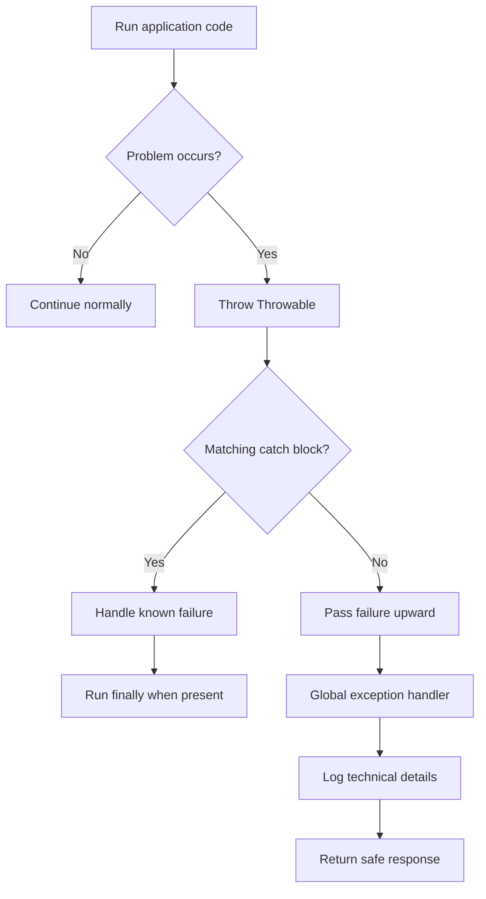
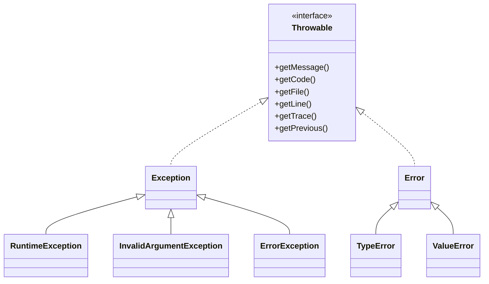
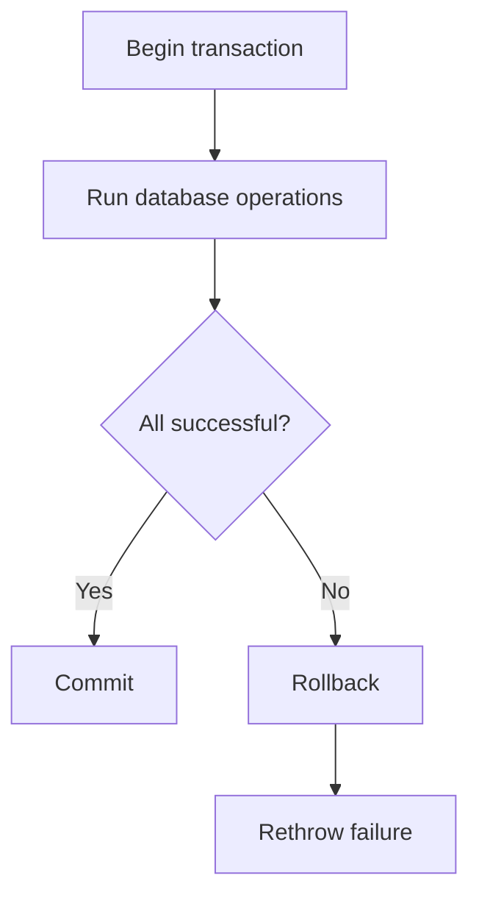

# PHP Error Handling and Exceptions

## Table of Contents

- [1. Overview](#1-overview)
- [2. Errors, Exceptions, and Throwable](#2-errors-exceptions-and-throwable)
- [3. Throwing Exceptions](#3-throwing-exceptions)
- [4. Try, Catch, and Finally](#4-try-catch-and-finally)
- [5. Built-in Exception Types](#5-built-in-exception-types)
- [6. Custom Exceptions](#6-custom-exceptions)
- [7. Exception Chaining and Rethrowing](#7-exception-chaining-and-rethrowing)
- [8. Error Reporting](#8-error-reporting)
- [9. Error and Exception Handlers](#9-error-and-exception-handlers)
- [10. Logging](#10-logging)
- [11. Web and JSON API Error Handling](#11-web-and-json-api-error-handling)
- [12. Database and File Examples](#12-database-and-file-examples)
- [13. Common Mistakes](#13-common-mistakes)
- [14. Best Practices](#14-best-practices)
- [15. Practice Exercises](#15-practice-exercises)
- [16. Official Documentation](#16-official-documentation)
- [17. Quick Reference](#17-quick-reference)

---

## 1. Overview

Error handling is the process of detecting, reporting, and responding to failures.

Common failures include:

- Invalid input
- Missing files
- Invalid JSON
- Database errors
- Unsupported operations
- Authorization failures
- Programming errors

A good application should:

- show safe messages to users;
- log technical details for developers;
- use suitable HTTP status codes;
- clean up files, locks, and transactions;
- avoid exposing stack traces, SQL, paths, credentials, or tokens.



---

## 2. Errors, Exceptions, and Throwable

PHP has two main throwable branches:

- `Exception`: normally used for application and runtime failures.
- `Error`: normally represents engine-level or programming failures.

Both implement `Throwable`.



At an application boundary, you may catch every failure:

```php
<?php

try {
    runApplication();
} catch (Throwable $throwable) {
    error_log((string) $throwable);

    http_response_code(500);
    echo 'An unexpected error occurred.';
}
```

Inside business code, prefer specific exception types.

---

## 3. Throwing Exceptions

Use `throw` when a function cannot complete its responsibility correctly.

```php
<?php

function divide(float $number, float $divisor): float
{
    if ($divisor === 0.0) {
        throw new InvalidArgumentException(
            'The divisor must not be zero.'
        );
    }

    return $number / $divisor;
}
```

`throw` can also be used in an expression:

```php
<?php

$userId = $_GET['id']
    ?? throw new InvalidArgumentException(
        'User ID is required.'
    );
```

Use exceptions for exceptional failure, not normal branching.

---

## 4. Try, Catch, and Finally

### Basic `try` and `catch`

```php
<?php

try {
    echo divide(10, 0);
} catch (InvalidArgumentException $exception) {
    echo 'Calculation failed: '
        . $exception->getMessage();
}
```

### Multiple catch blocks

```php
<?php

try {
    $user = loadUser(123);
} catch (InvalidArgumentException $exception) {
    echo 'The user ID is invalid.';
} catch (RuntimeException $exception) {
    echo 'The user could not be loaded.';
}
```

Catch the most specific type first.

### Union catch

```php
<?php

try {
    processPayment();
} catch (
    InvalidArgumentException
    | DomainException $exception
) {
    echo 'The payment request is invalid.';
}
```

### `finally`

A `finally` block runs whether an exception occurs or not.

```php
<?php

$handle = fopen(__DIR__ . '/data.txt', 'rb');

if ($handle === false) {
    throw new RuntimeException('Could not open file.');
}

try {
    $content = stream_get_contents($handle);

    if ($content === false) {
        throw new RuntimeException('Could not read file.');
    }

    echo $content;
} finally {
    fclose($handle);
}
```

Use `finally` for cleanup, not for hiding exceptions or returning values.

---

## 5. Built-in Exception Types

| Type | Typical purpose |
|---|---|
| `RuntimeException` | Failure during execution |
| `InvalidArgumentException` | Invalid function argument |
| `UnexpectedValueException` | Unexpected parsed or returned value |
| `DomainException` | Value outside a business rule |
| `LengthException` | Invalid length |
| `OutOfRangeException` | Invalid range or index |
| `LogicException` | Programming or design problem |
| `JsonException` | JSON encoding or decoding failure |
| `PDOException` | Database failure |
| `ErrorException` | PHP warning converted into an exception |
| `TypeError` | Invalid PHP value type |
| `ValueError` | Correct type but invalid value |

Example:

```php
<?php

function withdraw(float $balance, float $amount): float
{
    if ($amount <= 0) {
        throw new InvalidArgumentException(
            'Withdrawal amount must be positive.'
        );
    }

    if ($amount > $balance) {
        throw new DomainException(
            'Insufficient account balance.'
        );
    }

    return $balance - $amount;
}
```

---

## 6. Custom Exceptions

Custom exceptions give business failures clear names.

```php
<?php

class ApplicationException extends RuntimeException
{
}

final class ResourceNotFoundException
    extends ApplicationException
{
}

final class AuthorizationException
    extends ApplicationException
{
}

final class ValidationException
    extends ApplicationException
{
    public function __construct(
        private readonly array $errors,
        string $message = 'Validation failed.'
    ) {
        parent::__construct($message);
    }

    public function getErrors(): array
    {
        return $this->errors;
    }
}
```

Usage:

```php
<?php

throw new ValidationException([
    'email' => 'Enter a valid email address.',
]);
```

Custom types allow the application boundary to map failures to suitable responses.

---

## 7. Exception Chaining and Rethrowing

Exception chaining preserves the original cause.

```php
<?php

function loadSettings(string $filePath): array
{
    try {
        $json = file_get_contents($filePath);

        if ($json === false) {
            throw new RuntimeException(
                'Could not read settings file.'
            );
        }

        return json_decode(
            $json,
            true,
            512,
            JSON_THROW_ON_ERROR
        );
    } catch (JsonException $exception) {
        throw new RuntimeException(
            'Application settings are invalid.',
            previous: $exception
        );
    }
}
```

Read the original cause:

```php
<?php

$previous = $exception->getPrevious();
```

Rethrow when the current layer cannot fully handle the failure:

```php
<?php

try {
    processOrder();
} catch (RuntimeException $exception) {
    error_log($exception->getMessage());

    throw $exception;
}
```

Do not catch an exception only to ignore it.

---

## 8. Error Reporting

### Development

```php
<?php

error_reporting(E_ALL);

ini_set('display_errors', '1');
ini_set('display_startup_errors', '1');
ini_set('log_errors', '1');
```

### Production

```php
<?php

error_reporting(E_ALL);

ini_set('display_errors', '0');
ini_set('display_startup_errors', '0');
ini_set('log_errors', '1');
```

| Environment | Display details | Log details |
|---|---:|---:|
| Development | Yes | Yes |
| Testing | Usually yes | Yes |
| Production | No | Yes |

Production error pages must not expose paths, SQL, configuration, or stack traces.

---

## 9. Error and Exception Handlers

### Custom error handler

`set_error_handler()` can convert warnings into `ErrorException` objects.

```php
<?php

set_error_handler(
    function (
        int $severity,
        string $message,
        string $file,
        int $line
    ): bool {
        if (!(error_reporting() & $severity)) {
            return false;
        }

        throw new ErrorException(
            $message,
            0,
            $severity,
            $file,
            $line
        );
    }
);
```

Restore the previous handler when needed:

```php
<?php

restore_error_handler();
```

### Global exception handler

```php
<?php

set_exception_handler(
    function (Throwable $throwable): void {
        error_log((string) $throwable);

        http_response_code(500);
        header('Content-Type: text/html; charset=utf-8');

        echo '<h1>Application Error</h1>';
        echo '<p>Please try again later.</p>';
    }
);
```

The global handler is the final safety boundary. It should not throw another exception.

---

## 10. Logging

Simple logging:

```php
<?php

error_log('The payment operation failed.');
```

Structured exception logging:

```php
<?php

function logException(
    Throwable $throwable,
    array $context = []
): void {
    $entry = [
        'timestamp' => (new DateTimeImmutable())
            ->format(DATE_ATOM),
        'type' => $throwable::class,
        'message' => $throwable->getMessage(),
        'file' => $throwable->getFile(),
        'line' => $throwable->getLine(),
        'context' => $context,
    ];

    error_log(
        json_encode(
            $entry,
            JSON_UNESCAPED_SLASHES
            | JSON_UNESCAPED_UNICODE
            | JSON_THROW_ON_ERROR
        )
    );
}
```

Never log:

- passwords;
- access or refresh tokens;
- session IDs;
- payment-card data;
- private keys;
- complete sensitive request bodies.

---

## 11. Web and JSON API Error Handling

### Suggested HTTP mapping

| Failure | Status |
|---|---:|
| Validation failure | `422` |
| Resource not found | `404` |
| Authentication required | `401` |
| Forbidden operation | `403` |
| Resource conflict | `409` |
| Unsupported method | `405` |
| Unexpected failure | `500` |

### JSON response helper

```php
<?php

declare(strict_types=1);

function jsonResponse(
    array $payload,
    int $statusCode
): never {
    http_response_code($statusCode);

    header('Content-Type: application/json; charset=utf-8');
    header('Cache-Control: no-store');

    echo json_encode(
        $payload,
        JSON_UNESCAPED_SLASHES
        | JSON_UNESCAPED_UNICODE
        | JSON_THROW_ON_ERROR
    );

    exit;
}
```

### API exception mapping

```php
<?php

function handleApiException(
    Throwable $throwable
): never {
    if ($throwable instanceof ValidationException) {
        jsonResponse([
            'success' => false,
            'error' => [
                'code' => 'VALIDATION_ERROR',
                'message' => $throwable->getMessage(),
                'fields' => $throwable->getErrors(),
            ],
        ], 422);
    }

    if ($throwable instanceof ResourceNotFoundException) {
        jsonResponse([
            'success' => false,
            'error' => [
                'code' => 'NOT_FOUND',
                'message' => 'The resource was not found.',
            ],
        ], 404);
    }

    error_log((string) $throwable);

    jsonResponse([
        'success' => false,
        'error' => [
            'code' => 'INTERNAL_ERROR',
            'message' => 'An unexpected server error occurred.',
        ],
    ], 500);
}
```

Return consistent error shapes and never expose raw exception messages for unknown failures.

---

## 12. Database and File Examples

### Database transaction

```php
<?php

try {
    $pdo->beginTransaction();

    // Execute related database operations.

    $pdo->commit();
} catch (Throwable $throwable) {
    if ($pdo->inTransaction()) {
        $pdo->rollBack();
    }

    throw $throwable;
}
```



### Read and parse a JSON file

```php
<?php

function readJsonFile(string $filePath): array
{
    if (!is_file($filePath)) {
        throw new RuntimeException(
            'The requested file does not exist.'
        );
    }

    if (!is_readable($filePath)) {
        throw new RuntimeException(
            'The requested file is not readable.'
        );
    }

    $json = file_get_contents($filePath);

    if ($json === false) {
        throw new RuntimeException(
            'The file could not be read.'
        );
    }

    try {
        $data = json_decode(
            $json,
            true,
            512,
            JSON_THROW_ON_ERROR
        );
    } catch (JsonException $exception) {
        throw new UnexpectedValueException(
            'The file contains invalid JSON.',
            previous: $exception
        );
    }

    if (!is_array($data)) {
        throw new UnexpectedValueException(
            'The JSON root must be an object or array.'
        );
    }

    return $data;
}
```

---

## 13. Common Mistakes

### Catching every exception too early

Catch only when you can recover, add context, clean up, or translate the failure into a response.

### Empty catch blocks

```php
<?php

try {
    processPayment();
} catch (Throwable $throwable) {
    // Never silently ignore the failure.
}
```

### Showing stack traces to users

Do not echo exception objects in production.

### Catching `Exception` but missing `Error`

At a final application boundary, catch `Throwable`.

### Losing the original exception

Always preserve it with:

```php
previous: $exception
```

### Returning HTTP 200 for every API failure

Use the status code that matches the failure.

### Forgetting transaction rollback

Rollback before rethrowing.

### Returning from `finally`

A return inside `finally` can hide an earlier exception or return value.

---

## 14. Best Practices

- Throw specific exception types.
- Catch only failures you can handle.
- Keep user messages separate from developer logs.
- Preserve previous exceptions when wrapping.
- Use `finally` for cleanup.
- Roll back failed transactions.
- Add a global exception boundary.
- Disable detailed errors in production.
- Log useful context without sensitive data.
- Map application exceptions to HTTP statuses consistently.
- Test failure paths as carefully as success paths.

---

## 15. Practice Exercises

### Exercise 1: Safe division

Create a function that throws `InvalidArgumentException` when the divisor is zero.

### Exercise 2: Invalid JSON

Catch `JsonException` while decoding malformed JSON with `JSON_THROW_ON_ERROR`.

### Exercise 3: Custom not-found exception

Create `ProductNotFoundException` and throw it when an ID is not found.

### Exercise 4: File cleanup

Open a file, process it inside `try`, and close it in `finally`.

### Exercise 5: API validation response

Map `ValidationException` to HTTP `422` and return field-level errors.

### Exercise 6: Exception chaining

Wrap `JsonException` in `RuntimeException` while preserving the original cause.

---

## 16. Official Documentation

No package is required for PHP exceptions and basic error handling.

- [PHP Exceptions](https://www.php.net/manual/en/language.exceptions.php)
- [Extending Exceptions](https://www.php.net/manual/en/language.exceptions.extending.php)
- [`Throwable`](https://www.php.net/manual/en/class.throwable.php)
- [`Exception`](https://www.php.net/manual/en/class.exception.php)
- [`Error`](https://www.php.net/manual/en/class.error.php)
- [Predefined Exceptions](https://www.php.net/manual/en/spl.exceptions.php)
- [PHP Errors](https://www.php.net/manual/en/language.errors.php)
- [`error_reporting()`](https://www.php.net/manual/en/function.error-reporting.php)
- [`set_error_handler()`](https://www.php.net/manual/en/function.set-error-handler.php)
- [`set_exception_handler()`](https://www.php.net/manual/en/function.set-exception-handler.php)
- [`error_log()`](https://www.php.net/manual/en/function.error-log.php)
- [`ErrorException`](https://www.php.net/manual/en/class.errorexception.php)
- [`JsonException`](https://www.php.net/manual/en/class.jsonexception.php)
- [`PDOException`](https://www.php.net/manual/en/class.pdoexception.php)
- [Download PHP](https://www.php.net/downloads.php)

For larger applications, [Monolog](https://github.com/Seldaek/monolog) is a common optional logging library:

```bash
composer require monolog/monolog
```

---

## 17. Quick Reference

| Topic | Purpose |
|---|---|
| `throw` | Signals that an operation cannot continue |
| `try` | Contains code that may fail |
| `catch` | Handles a matching throwable |
| `finally` | Runs cleanup code |
| `Throwable` | Parent interface for exceptions and errors |
| Custom exception | Gives a business failure a clear type |
| Exception chaining | Preserves the original cause |
| Global handler | Handles uncaught failures safely |
| Error reporting | Controls PHP error visibility |
| Logging | Records technical details |
| HTTP status | Communicates failure type to clients |

Recommended defaults:

- Throw specific exceptions.
- Catch only what you can handle.
- Preserve previous exceptions.
- Log technical details and show safe public messages.
- Disable detailed error display in production.
- Use a global exception handler.
- Test invalid inputs, missing resources, database failures, and unexpected exceptions.
