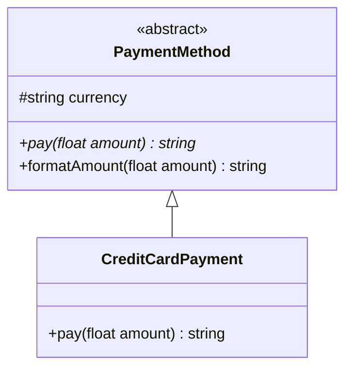

# PHP Abstract Classes

## Table of Contents

- [1. Overview](#1-overview)
- [2. Define an Abstract Class](#2-define-an-abstract-class)
- [3. Implement Abstract Methods](#3-implement-abstract-methods)
- [4. Shared State and Behavior](#4-shared-state-and-behavior)
- [5. Abstract Class vs Interface](#5-abstract-class-vs-interface)
- [6. Best Practices](#6-best-practices)
- [7. Official Documentation](#7-official-documentation)

---

## 1. Overview

An abstract class cannot be instantiated directly. It can define shared state, implemented methods, constructors, and abstract methods.

## 2. Define an Abstract Class

```php
<?php

abstract class PaymentMethod
{
    public function __construct(protected string $currency)
    {
    }

    abstract public function pay(float $amount): string;

    public function formatAmount(float $amount): string
    {
        return number_format($amount, 2) . ' ' . $this->currency;
    }
}
```

## 3. Implement Abstract Methods

A concrete child class must implement every abstract method.

```php
<?php

final class CreditCardPayment extends PaymentMethod
{
    public function pay(float $amount): string
    {
        if ($amount <= 0) {
            throw new InvalidArgumentException('Amount must be positive.');
        }

        return 'Paid ' . $this->formatAmount($amount) . ' by credit card.';
    }
}
```



## 4. Shared State and Behavior

Use an abstract class when related classes need both common data and common implementation.

```php
<?php

abstract class Report
{
    public function __construct(protected string $title)
    {
    }

    abstract protected function buildBody(): string;

    public function render(): string
    {
        return "# {$this->title}\n\n" . $this->buildBody();
    }
}
```

## 5. Abstract Class vs Interface

| Feature | Abstract class | Interface |
|---|---|---|
| Shared instance state | Yes | No normal instance state |
| Implemented methods | Yes | Contract-focused |
| Constructor | Yes | No normal instance constructor |
| Multiple use | Extend one | Implement many |
| Best use | Shared base implementation | Capability or contract |

## 6. Best Practices

- Use abstract classes for closely related types.
- Keep shared behavior genuinely common.
- Avoid deep inheritance trees.
- Use interfaces when callers only need a contract.
- Do not use an abstract class only as a container for unrelated helpers.

## 7. Official Documentation

- [PHP Abstract Classes](https://www.php.net/manual/en/language.oop5.abstract.php)
