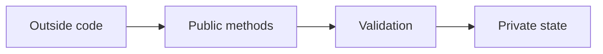

# PHP Access Modifiers and Encapsulation

## Table of Contents

- [1. Overview](#1-overview)
- [2. Public](#2-public)
- [3. Protected](#3-protected)
- [4. Private](#4-private)
- [5. Encapsulation](#5-encapsulation)
- [6. Best Practices](#6-best-practices)
- [7. Official Documentation](#7-official-documentation)

---

## 1. Overview

Access modifiers control where class members can be used.

| Modifier | Same class | Child class | Outside class |
|---|---:|---:|---:|
| `public` | Yes | Yes | Yes |
| `protected` | Yes | Yes | No |
| `private` | Yes | No | No |

## 2. Public

Public members form the external API of a class.

```php
<?php

final class User
{
    public function __construct(public string $name)
    {
    }

    public function greet(): string
    {
        return "Hello, {$this->name}";
    }
}
```

## 3. Protected

Protected members are available inside the class and child classes.

```php
<?php

class Employee
{
    protected float $salary = 0.0;

    protected function calculateBonus(): float
    {
        return $this->salary * 0.10;
    }
}
```

## 4. Private

Private members are available only inside the declaring class.

```php
<?php

final class Password
{
    private string $hash;

    public function __construct(string $plainPassword)
    {
        $this->hash = password_hash($plainPassword, PASSWORD_DEFAULT);
    }

    public function verify(string $plainPassword): bool
    {
        return password_verify($plainPassword, $this->hash);
    }
}
```

## 5. Encapsulation

Encapsulation protects object state and exposes controlled behavior.

```php
<?php

final class BankAccount
{
    private float $balance = 0.0;

    public function deposit(float $amount): void
    {
        if ($amount <= 0) {
            throw new InvalidArgumentException('Amount must be positive.');
        }

        $this->balance += $amount;
    }

    public function withdraw(float $amount): void
    {
        if ($amount <= 0 || $amount > $this->balance) {
            throw new DomainException('Invalid withdrawal.');
        }

        $this->balance -= $amount;
    }

    public function getBalance(): float
    {
        return $this->balance;
    }
}
```



## 6. Best Practices

- Keep state private by default.
- Expose meaningful methods instead of raw setters.
- Use protected members only when child classes genuinely need them.
- Keep the public API small and intentional.
- Prevent invalid state transitions inside methods.

## 7. Official Documentation

- [PHP Visibility](https://www.php.net/manual/en/language.oop5.visibility.php)
