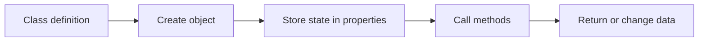
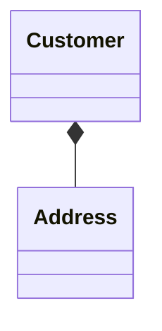

# PHP Classes and Objects

## Table of Contents

- [1. Overview](#1-overview)
- [2. Define a Class](#2-define-a-class)
- [3. Create Objects](#3-create-objects)
- [4. Properties and Methods](#4-properties-and-methods)
- [5. The `$this` Variable](#5-the-this-variable)
- [6. Typed and Readonly Properties](#6-typed-and-readonly-properties)
- [7. Object Relationships](#7-object-relationships)
- [8. Polymorphism](#8-polymorphism)
- [9. Common Mistakes](#9-common-mistakes)
- [10. Best Practices](#10-best-practices)
- [11. Practice](#11-practice)
- [12. Official Documentation](#12-official-documentation)

---

## 1. Overview

Object-oriented programming organizes code around objects that combine state and behavior.



A class is a blueprint. An object is one instance of that class.

## 2. Define a Class

```php
<?php

declare(strict_types=1);

class Product
{
    public string $name;
    public float $price;

    public function getDescription(): string
    {
        return sprintf('%s: $%.2f', $this->name, $this->price);
    }
}
```

## 3. Create Objects

Use `new` to create an object:

```php
<?php

$product = new Product();
$product->name = 'Keyboard';
$product->price = 50.00;

echo $product->getDescription();
```

Each object has independent property values.

## 4. Properties and Methods

Properties store data. Methods define behavior.

```php
<?php

final class BankAccount
{
    private float $balance = 0.0;

    public function deposit(float $amount): void
    {
        if ($amount <= 0) {
            throw new InvalidArgumentException('Amount must be positive.');
        }

        $this->balance += $amount;
    }

    public function getBalance(): float
    {
        return $this->balance;
    }
}
```

## 5. The `$this` Variable

`$this` refers to the object currently executing the method.

```php
<?php

final class User
{
    public string $name;

    public function rename(string $name): void
    {
        $this->name = $name;
    }
}
```

`$this` is not available in static methods.

## 6. Typed and Readonly Properties

Typed properties make object contracts clear:

```php
<?php

final class Article
{
    public int $id;
    public string $title;
    public bool $published = false;
    public ?DateTimeImmutable $publishedAt = null;
}
```

Readonly properties prevent reassignment:

```php
<?php

final readonly class Money
{
    public function __construct(
        public float $amount,
        public string $currency
    ) {
    }
}
```

Readonly does not make referenced objects deeply immutable.

## 7. Object Relationships

### Dependency injection

```php
<?php

interface MailerInterface
{
    public function send(string $recipient, string $message): void;
}

final class RegistrationService
{
    public function __construct(
        private MailerInterface $mailer
    ) {
    }
}
```

### Composition

```php
<?php

final readonly class Address
{
    public function __construct(
        public string $city,
        public string $country
    ) {
    }
}

final readonly class Customer
{
    public function __construct(
        public string $name,
        public Address $address
    ) {
    }
}
```



Use inheritance for a true **is-a** relationship and composition for a **has-a** relationship.

## 8. Polymorphism

Polymorphism lets different implementations work through one contract.

```php
<?php

interface PaymentGatewayInterface
{
    public function charge(float $amount): string;
}

final class StripeGateway implements PaymentGatewayInterface
{
    public function charge(float $amount): string
    {
        return "Stripe charged {$amount}.";
    }
}

final class CheckoutService
{
    public function __construct(
        private PaymentGatewayInterface $gateway
    ) {
    }

    public function checkout(float $amount): string
    {
        return $this->gateway->charge($amount);
    }
}
```

## 9. Common Mistakes

- Making every property public.
- Creating objects in an invalid state.
- Building large classes with unrelated responsibilities.
- Depending directly on concrete implementations.
- Using inheritance only to reuse code.

## 10. Best Practices

- Keep classes focused.
- Hide internal state.
- Validate objects during construction.
- Use typed properties and return types.
- Prefer composition over inheritance.
- Inject dependencies through constructors.
- Depend on interfaces.

## 11. Practice

Create a `Book` class with title, author, price, constructor validation, and a `getDescription()` method.

## 12. Official Documentation

- [PHP Classes and Objects](https://www.php.net/manual/en/language.oop5.php)
- [Class Basics](https://www.php.net/manual/en/language.oop5.basic.php)
- [Properties](https://www.php.net/manual/en/language.oop5.properties.php)
