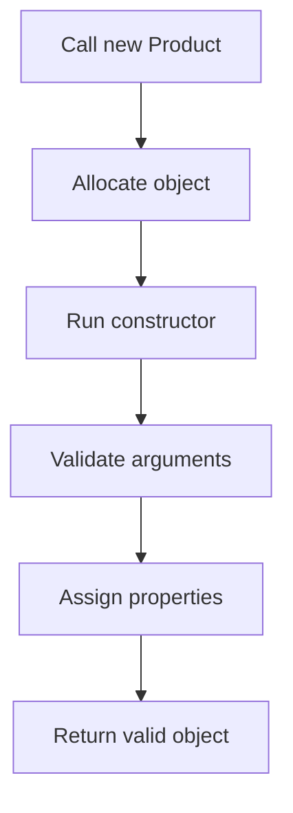

# PHP Constructor and Destructor

## Table of Contents

- [1. Constructor](#1-constructor)
- [2. Property Promotion](#2-property-promotion)
- [3. Constructor Validation](#3-constructor-validation)
- [4. Destructor](#4-destructor)
- [5. Common Mistakes](#5-common-mistakes)
- [6. Best Practices](#6-best-practices)
- [7. Official Documentation](#7-official-documentation)

---

## 1. Constructor

A constructor runs automatically when an object is created.

```php
<?php

final class Product
{
    public string $name;
    public float $price;

    public function __construct(string $name, float $price)
    {
        if ($name === '') {
            throw new InvalidArgumentException('Name is required.');
        }

        if ($price < 0) {
            throw new InvalidArgumentException('Price must not be negative.');
        }

        $this->name = $name;
        $this->price = $price;
    }
}

$product = new Product('Keyboard', 50.00);
```



## 2. Property Promotion

Constructor property promotion declares and assigns properties in one place.

```php
<?php

final class Product
{
    public function __construct(
        public readonly string $name,
        public readonly float $price,
        private int $stock = 0
    ) {
        if ($price < 0 || $stock < 0) {
            throw new InvalidArgumentException('Invalid product data.');
        }
    }
}
```

Use promotion when constructor parameters directly represent object properties.

## 3. Constructor Validation

A constructor should prevent invalid objects.

```php
<?php

final readonly class EmailAddress
{
    public function __construct(public string $value)
    {
        if (filter_var($value, FILTER_VALIDATE_EMAIL) === false) {
            throw new InvalidArgumentException('Invalid email address.');
        }
    }
}
```

## 4. Destructor

A destructor runs when an object is destroyed or the request ends.

```php
<?php

final class TemporaryFile
{
    public function __construct(private string $filePath)
    {
    }

    public function __destruct()
    {
        if (is_file($this->filePath)) {
            unlink($this->filePath);
        }
    }
}
```

Use destructors carefully. Do not depend on them for payments, transactions, or other critical work.

## 5. Common Mistakes

- Creating objects first and validating later.
- Putting too much unrelated work in constructors.
- Performing slow network calls in constructors.
- Depending on destructors for important business actions.

## 6. Best Practices

- Create valid objects immediately.
- Keep constructors predictable.
- Use property promotion for simple assignments.
- Use readonly properties for immutable values.
- Make resource cleanup explicit when correctness matters.

## 7. Official Documentation

- [Constructors and Destructors](https://www.php.net/manual/en/language.oop5.decon.php)
- [Constructor Property Promotion](https://www.php.net/manual/en/language.oop5.decon.php#language.oop5.decon.constructor.promotion)
