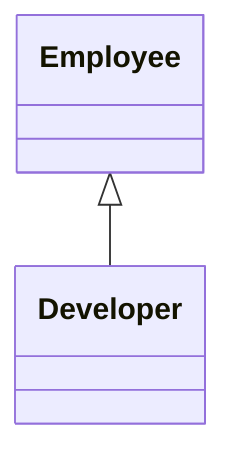

# PHP Inheritance

## Table of Contents

- [1. Overview](#1-overview)
- [2. Extending a Class](#2-extending-a-class)
- [3. Method Overriding](#3-method-overriding)
- [4. Parent Methods](#4-parent-methods)
- [5. Final Classes and Methods](#5-final-classes-and-methods)
- [6. Inheritance vs Composition](#6-inheritance-vs-composition)
- [7. Best Practices](#7-best-practices)
- [8. Official Documentation](#8-official-documentation)

---

## 1. Overview

Inheritance creates a subtype from a parent class.



Use inheritance only for a real **is-a** relationship.

## 2. Extending a Class

```php
<?php

class Employee
{
    public function __construct(protected string $name)
    {
    }

    public function getName(): string
    {
        return $this->name;
    }

    public function getRole(): string
    {
        return 'Employee';
    }
}

final class Developer extends Employee
{
    public function getProgrammingLanguage(): string
    {
        return 'PHP';
    }
}
```

## 3. Method Overriding

A child class can replace parent behavior.

```php
<?php

final class Developer extends Employee
{
    public function getRole(): string
    {
        return 'Developer';
    }
}
```

The child method must remain compatible with the parent contract.

## 4. Parent Methods

Use `parent::` to reuse parent behavior.

```php
<?php

class Developer extends Employee
{
    public function getRole(): string
    {
        return 'Developer';
    }
}

final class SeniorDeveloper extends Developer
{
    public function getRole(): string
    {
        return 'Senior ' . parent::getRole();
    }
}
```

Parent constructor:

```php
<?php

final class Manager extends Employee
{
    public function __construct(
        string $name,
        private int $teamSize
    ) {
        parent::__construct($name);
    }
}
```

## 5. Final Classes and Methods

A final class cannot be extended.

```php
<?php

final class ApplicationConfig
{
}
```

A final method cannot be overridden.

```php
<?php

class BaseController
{
    final public function execute(): void
    {
        // Fixed process.
    }
}
```

## 6. Inheritance vs Composition

| Relationship | Meaning | Example |
|---|---|---|
| Inheritance | is a | Developer is an Employee |
| Composition | has a | Customer has an Address |

Prefer composition when the relationship is not a true subtype.

## 7. Best Practices

- Keep inheritance trees shallow.
- Preserve parent method contracts.
- Use `final` when extension would break invariants.
- Prefer composition for reusable services and dependencies.
- Do not inherit only to reuse a few methods.

## 8. Official Documentation

- [Object Inheritance](https://www.php.net/manual/en/language.oop5.inheritance.php)
- [Final Keyword](https://www.php.net/manual/en/language.oop5.final.php)
