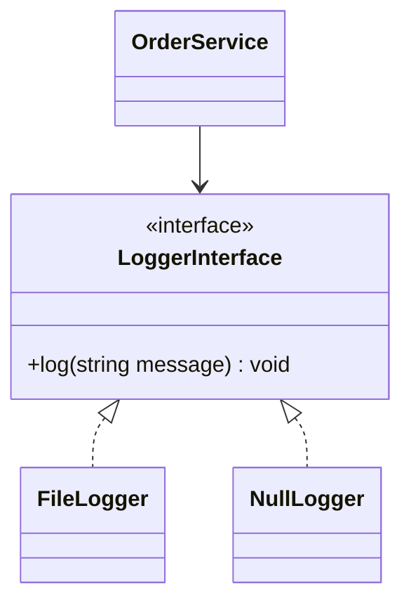

# PHP Interfaces

## Table of Contents

- [1. Overview](#1-overview)
- [2. Define an Interface](#2-define-an-interface)
- [3. Implement an Interface](#3-implement-an-interface)
- [4. Multiple Interfaces](#4-multiple-interfaces)
- [5. Dependency Injection](#5-dependency-injection)
- [6. Interface vs Abstract Class](#6-interface-vs-abstract-class)
- [7. Best Practices](#7-best-practices)
- [8. Official Documentation](#8-official-documentation)

---

## 1. Overview

An interface defines a contract. It tells classes what behavior they must provide without deciding how that behavior is implemented.

## 2. Define an Interface

```php
<?php

interface LoggerInterface
{
    public function log(string $message): void;
}
```

## 3. Implement an Interface

```php
<?php

final class FileLogger implements LoggerInterface
{
    public function __construct(private string $filePath)
    {
    }

    public function log(string $message): void
    {
        $line = sprintf(
            "[%s] %s%s",
            (new DateTimeImmutable())->format(DATE_ATOM),
            $message,
            PHP_EOL
        );

        if (file_put_contents($this->filePath, $line, FILE_APPEND | LOCK_EX) === false) {
            throw new RuntimeException('Could not write the log.');
        }
    }
}

final class NullLogger implements LoggerInterface
{
    public function log(string $message): void
    {
        // Intentionally empty.
    }
}
```

## 4. Multiple Interfaces

A class can implement many interfaces.

```php
<?php

interface Identifiable
{
    public function getId(): int;
}

interface ArrayConvertible
{
    public function toArray(): array;
}

final class User implements Identifiable, ArrayConvertible
{
    public function __construct(
        private int $id,
        private string $name
    ) {
    }

    public function getId(): int
    {
        return $this->id;
    }

    public function toArray(): array
    {
        return ['id' => $this->id, 'name' => $this->name];
    }
}
```

## 5. Dependency Injection

Depend on interfaces instead of concrete classes.

```php
<?php

final class OrderService
{
    public function __construct(private LoggerInterface $logger)
    {
    }

    public function createOrder(): void
    {
        $this->logger->log('Order created.');
    }
}
```



## 6. Interface vs Abstract Class

| Feature | Interface | Abstract class |
|---|---|---|
| Main purpose | Contract | Shared base implementation |
| Multiple use | Implement many | Extend one |
| Shared instance state | No normal state | Yes |
| Constructor | No normal constructor | Yes |

## 7. Best Practices

- Keep interfaces small and focused.
- Name interfaces after capabilities or roles.
- Depend on interfaces at service boundaries.
- Avoid interfaces that mirror one class without a clear reason.
- Preserve method signatures in every implementation.

## 8. Official Documentation

- [PHP Object Interfaces](https://www.php.net/manual/en/language.oop5.interfaces.php)
