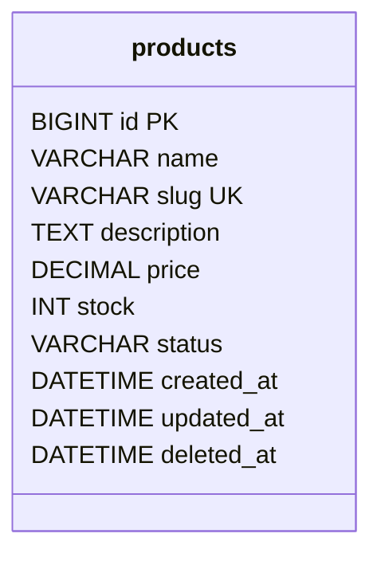

# Create a Database and Table

## Table of Contents

- [1. Create a Database](#1-create-a-database)
- [2. Create a Table](#2-create-a-table)
- [3. Column Types](#3-column-types)
- [4. Keys and Constraints](#4-keys-and-constraints)
- [5. Indexes](#5-indexes)
- [6. Relationships](#6-relationships)
- [7. Run SQL from PHP](#7-run-sql-from-php)
- [8. Best Practices](#8-best-practices)
- [9. Official Documentation](#9-official-documentation)

---

## 1. Create a Database

```sql
CREATE DATABASE IF NOT EXISTS php_app
    CHARACTER SET utf8mb4
    COLLATE utf8mb4_unicode_ci;
```

Select it:

```sql
USE php_app;
```

`utf8mb4` supports the complete Unicode range, including emoji.

---

## 2. Create a Table

```sql
CREATE TABLE products (
    id BIGINT UNSIGNED AUTO_INCREMENT PRIMARY KEY,
    name VARCHAR(150) NOT NULL,
    slug VARCHAR(180) NOT NULL UNIQUE,
    description TEXT NULL,
    price DECIMAL(12, 2) NOT NULL,
    stock INT UNSIGNED NOT NULL DEFAULT 0,
    status VARCHAR(30) NOT NULL DEFAULT 'active',
    created_at DATETIME NOT NULL,
    updated_at DATETIME NOT NULL,
    deleted_at DATETIME NULL,

    INDEX idx_products_name (name),
    INDEX idx_products_status (status),
    INDEX idx_products_price (price),
    INDEX idx_products_created_at (created_at),
    INDEX idx_products_deleted_at (deleted_at)
) ENGINE=InnoDB;
```



---

## 3. Column Types

| Type | Typical use |
|---|---|
| `INT`, `BIGINT` | IDs and counters |
| `VARCHAR` | Short text |
| `TEXT` | Long text |
| `DECIMAL` | Money and exact decimal values |
| `DATETIME` | Date and time |
| `BOOLEAN` or `TINYINT(1)` | True/false state |
| `JSON` | Structured data when appropriate |

Use `DECIMAL`, not `FLOAT`, for normal monetary values.

---

## 4. Keys and Constraints

| Feature | Purpose |
|---|---|
| Primary key | Uniquely identifies a row |
| `NOT NULL` | Requires a value |
| `UNIQUE` | Prevents duplicate values |
| Default value | Supplies an initial value |
| Foreign key | Protects relationships |
| `CHECK` | Restricts valid values where supported |

Example status constraint:

```sql
ALTER TABLE products
ADD CONSTRAINT chk_products_status
CHECK (status IN ('active', 'inactive'));
```

---

## 5. Indexes

Indexes improve queries that frequently filter, join, or sort by selected columns.

```sql
CREATE INDEX idx_products_status_price
ON products (status, price);
```

Do not add indexes to every column. Each index also increases storage and write cost.

---

## 6. Relationships

```sql
CREATE TABLE categories (
    id BIGINT UNSIGNED AUTO_INCREMENT PRIMARY KEY,
    name VARCHAR(150) NOT NULL UNIQUE
) ENGINE=InnoDB;

ALTER TABLE products
ADD category_id BIGINT UNSIGNED NULL,
ADD CONSTRAINT fk_products_category
    FOREIGN KEY (category_id)
    REFERENCES categories(id)
    ON UPDATE CASCADE
    ON DELETE SET NULL;
```

Choose delete behavior intentionally:

- `RESTRICT`: block deletion when related rows exist;
- `CASCADE`: delete related rows;
- `SET NULL`: keep rows but remove the relationship.

---

## 7. Run SQL from PHP

Use `exec()` only for trusted SQL without user input.

```php
<?php

$sql = file_get_contents(__DIR__ . '/schema.sql');

if ($sql === false) {
    throw new RuntimeException('Could not read schema file.');
}

$pdo->exec($sql);
```

For production projects, use migrations to track schema changes.

---

## 8. Best Practices

- Use InnoDB.
- Use `utf8mb4`.
- Add primary keys to application tables.
- Use `DECIMAL` for money.
- Add constraints for important data rules.
- Add indexes based on actual query patterns.
- Name indexes and foreign keys clearly.
- Track schema changes with migrations.
- Test rollback and backup procedures.

---

## 9. Official Documentation

- [MySQL CREATE DATABASE](https://dev.mysql.com/doc/refman/en/create-database.html)
- [MySQL CREATE TABLE](https://dev.mysql.com/doc/refman/en/create-table.html)
- [MySQL InnoDB](https://dev.mysql.com/doc/refman/en/innodb-storage-engine.html)
- [MariaDB documentation](https://mariadb.com/kb/en/documentation/)
