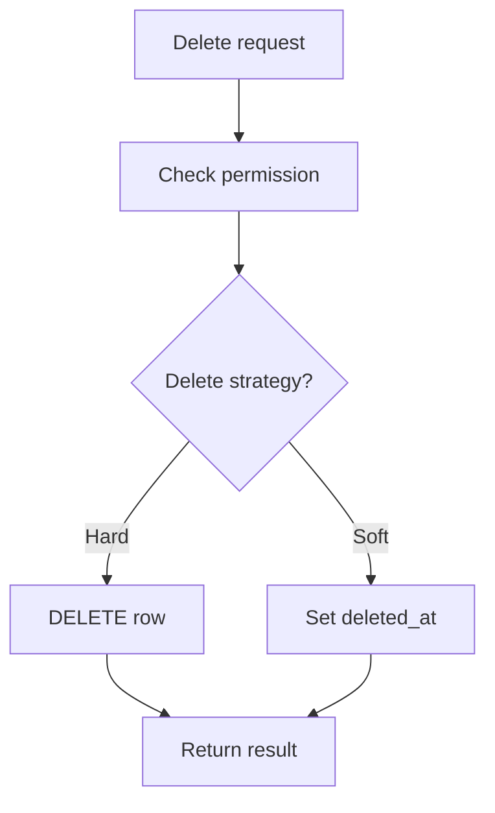

# Delete Data with PHP PDO

## Table of Contents

- [1. Hard Delete](#1-hard-delete)
- [2. Soft Delete](#2-soft-delete)
- [3. Restore a Soft-Deleted Row](#3-restore-a-soft-deleted-row)
- [4. Relationships and Transactions](#4-relationships-and-transactions)
- [5. Authorization](#5-authorization)
- [6. Common Mistakes](#6-common-mistakes)
- [7. Best Practices](#7-best-practices)
- [8. Official Documentation](#8-official-documentation)

---

## 1. Hard Delete

A hard delete permanently removes a row.

```php
<?php

$statement = $pdo->prepare(
    'DELETE FROM products
     WHERE id = :id'
);

$statement->execute(['id' => 10]);
```

Use hard deletion only when permanent removal is intended.

---

## 2. Soft Delete

Soft deletion keeps the row and records when it was deleted.

```php
<?php

$now = gmdate('Y-m-d H:i:s');

$statement = $pdo->prepare(
    'UPDATE products
     SET
        deleted_at = :deleted_at,
        updated_at = :updated_at
     WHERE id = :id
       AND deleted_at IS NULL'
);

$statement->execute([
    'id' => 10,
    'deleted_at' => $now,
    'updated_at' => $now,
]);
```

Normal queries must then include:

```sql
WHERE deleted_at IS NULL
```



---

## 3. Restore a Soft-Deleted Row

```php
<?php

$statement = $pdo->prepare(
    'UPDATE products
     SET
        deleted_at = NULL,
        updated_at = :updated_at
     WHERE id = :id
       AND deleted_at IS NOT NULL'
);

$statement->execute([
    'id' => 10,
    'updated_at' => gmdate('Y-m-d H:i:s'),
]);
```

---

## 4. Relationships and Transactions

Foreign keys determine what happens to related rows.

| Rule | Behavior |
|---|---|
| `RESTRICT` | Blocks deletion when related rows exist |
| `CASCADE` | Deletes related rows automatically |
| `SET NULL` | Keeps related rows and clears the foreign key |

For manual multi-table cleanup, use a transaction:

```php
<?php

$pdo->beginTransaction();

try {
    $deleteItems->execute(['order_id' => $orderId]);
    $deleteOrder->execute(['id' => $orderId]);

    $pdo->commit();
} catch (Throwable $throwable) {
    if ($pdo->inTransaction()) {
        $pdo->rollBack();
    }

    throw $throwable;
}
```

---

## 5. Authorization

Before deleting a row:

- authenticate the user;
- verify ownership or permission;
- validate the row ID;
- use CSRF protection for browser forms;
- confirm destructive actions in the UI when appropriate.

Prepared statements prevent SQL injection but do not provide authorization.

---

## 6. Common Mistakes

- Running `DELETE` without a `WHERE` clause.
- Deleting before checking ownership.
- Ignoring foreign-key behavior.
- Using hard deletion when audit history is required.
- Forgetting to exclude soft-deleted rows from normal queries.
- Performing several dependent deletes without a transaction.
- Trusting a delete request without CSRF protection.

---

## 7. Best Practices

- Choose hard or soft deletion intentionally.
- Use prepared statements.
- Verify authorization before deletion.
- Use foreign keys to protect relationships.
- Use transactions for dependent operations.
- Keep audit records when required.
- Test restore and purge processes for soft-deleted data.

---

## 8. Official Documentation

- [PDO prepared statements](https://www.php.net/manual/en/pdo.prepared-statements.php)
- [PDO transactions](https://www.php.net/manual/en/pdo.transactions.php)
- [MySQL DELETE](https://dev.mysql.com/doc/refman/en/delete.html)
- [MySQL foreign keys](https://dev.mysql.com/doc/refman/en/create-table-foreign-keys.html)
