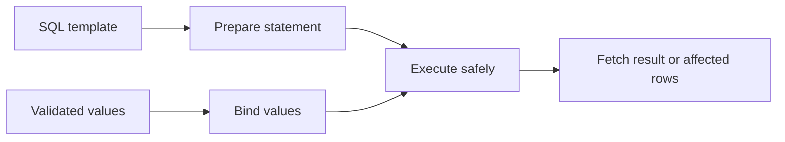

# Prepared Statements with PHP PDO

## Table of Contents

- [1. Overview](#1-overview)
- [2. Named Placeholders](#2-named-placeholders)
- [3. Positional Placeholders](#3-positional-placeholders)
- [4. Bind Values and Types](#4-bind-values-and-types)
- [5. Dynamic SQL Safely](#5-dynamic-sql-safely)
- [6. Transactions](#6-transactions)
- [7. Repository Example](#7-repository-example)
- [8. SQL Injection Prevention](#8-sql-injection-prevention)
- [9. Common Mistakes](#9-common-mistakes)
- [10. Best Practices](#10-best-practices)
- [11. Official Documentation](#11-official-documentation)

---

## 1. Overview

Prepared statements separate SQL structure from data values.



They are the default choice whenever a query contains dynamic values.

---

## 2. Named Placeholders

```php
<?php

$statement = $pdo->prepare(
    'SELECT id, name, email
     FROM users
     WHERE email = :email
       AND status = :status'
);

$statement->execute([
    'email' => 'alan@example.com',
    'status' => 'active',
]);

$user = $statement->fetch();
```

Named placeholders are readable in queries with many parameters.

---

## 3. Positional Placeholders

```php
<?php

$statement = $pdo->prepare(
    'SELECT id, name
     FROM products
     WHERE price >= ?
       AND price <= ?'
);

$statement->execute([
    '20.00',
    '100.00',
]);
```

Do not mix named and positional placeholders in one statement.

---

## 4. Bind Values and Types

Use `bindValue()` when the driver needs an explicit type, especially for `LIMIT`, `OFFSET`, and integer IDs.

```php
<?php

$statement = $pdo->prepare(
    'SELECT id, name
     FROM products
     WHERE stock >= :minimum_stock
     LIMIT :limit'
);

$statement->bindValue(
    ':minimum_stock',
    10,
    PDO::PARAM_INT
);

$statement->bindValue(
    ':limit',
    20,
    PDO::PARAM_INT
);

$statement->execute();
```

| PDO constant | Purpose |
|---|---|
| `PDO::PARAM_INT` | Integer |
| `PDO::PARAM_STR` | String |
| `PDO::PARAM_BOOL` | Boolean |
| `PDO::PARAM_NULL` | Null |
| `PDO::PARAM_LOB` | Large object |

---

## 5. Dynamic SQL Safely

Placeholders cannot represent:

- column names;
- table names;
- sort directions;
- SQL keywords.

Use allowlists for identifiers:

```php
<?php

$allowedColumns = [
    'name' => 'name',
    'price' => 'price',
    'created_at' => 'created_at',
];

$requestedSort = $_GET['sort'] ?? 'created_at';
$sortColumn = $allowedColumns[$requestedSort]
    ?? $allowedColumns['created_at'];

$sql = "SELECT id, name, price
        FROM products
        ORDER BY {$sortColumn} DESC";

$products = $pdo->query($sql)->fetchAll();
```

Dynamic filters:

```php
<?php

$conditions = ['deleted_at IS NULL'];
$parameters = [];

if ($search !== '') {
    $conditions[] = 'name LIKE :search';
    $parameters['search'] = '%' . $search . '%';
}

if (in_array($status, ['active', 'inactive'], true)) {
    $conditions[] = 'status = :status';
    $parameters['status'] = $status;
}

$sql = sprintf(
    'SELECT id, name, price, status
     FROM products
     WHERE %s',
    implode(' AND ', $conditions)
);

$statement = $pdo->prepare($sql);
$statement->execute($parameters);
```

---

## 6. Transactions

Prepared statements and transactions solve different problems:

- prepared statements separate SQL from values;
- transactions keep related operations consistent.

```php
<?php

$pdo->beginTransaction();

try {
    $createOrder->execute($orderData);
    $reduceStock->execute($stockData);

    if ($reduceStock->rowCount() !== 1) {
        throw new DomainException(
            'Product has insufficient stock.'
        );
    }

    $pdo->commit();
} catch (Throwable $throwable) {
    if ($pdo->inTransaction()) {
        $pdo->rollBack();
    }

    throw $throwable;
}
```

---

## 7. Repository Example

```php
<?php

declare(strict_types=1);

final class ProductRepository
{
    public function __construct(
        private readonly PDO $pdo
    ) {
    }

    public function create(array $data): int
    {
        $statement = $this->pdo->prepare(
            'INSERT INTO products (
                name, slug, description, price,
                stock, status, created_at, updated_at
             ) VALUES (
                :name, :slug, :description, :price,
                :stock, :status, :created_at, :updated_at
             )'
        );

        $statement->execute($data);

        return (int) $this->pdo->lastInsertId();
    }

    public function findById(int $id): ?array
    {
        $statement = $this->pdo->prepare(
            'SELECT id, name, slug, price, stock, status
             FROM products
             WHERE id = :id
               AND deleted_at IS NULL
             LIMIT 1'
        );

        $statement->execute(['id' => $id]);
        $product = $statement->fetch();

        return $product === false ? null : $product;
    }
}
```

---

## 8. SQL Injection Prevention

Unsafe:

```php
<?php

$sql = "SELECT * FROM users
        WHERE email = '" . $_GET['email'] . "'";
```

Safe:

```php
<?php

$statement = $pdo->prepare(
    'SELECT id, name, email
     FROM users
     WHERE email = :email'
);

$statement->execute([
    'email' => $_GET['email'] ?? '',
]);
```

Prepared statements protect SQL values. You still need:

- input validation;
- authentication and authorization;
- CSRF protection;
- output escaping;
- database constraints;
- least-privilege credentials.

---

## 9. Common Mistakes

- Concatenating request data into SQL.
- Trying to bind a table or column name.
- Mixing named and positional placeholders.
- Reusing one named placeholder several times without checking driver behavior.
- Passing a comma-separated string to one `IN` placeholder.
- Treating prepared statements as complete application security.
- Displaying raw `PDOException` messages.

---

## 10. Best Practices

- Prepare every query containing values.
- Prefer clear named placeholders for complex SQL.
- Bind integers explicitly where required.
- Use allowlists for identifiers and directions.
- Validate values before execution.
- Use transactions for related writes.
- Keep SQL in repositories or data-access classes as the project grows.
- Use a dedicated database account with minimum permissions.

---

## 11. Official Documentation

- [PDO prepared statements](https://www.php.net/manual/en/pdo.prepared-statements.php)
- [PDO::prepare()](https://www.php.net/manual/en/pdo.prepare.php)
- [PDOStatement::execute()](https://www.php.net/manual/en/pdostatement.execute.php)
- [PDOStatement::bindValue()](https://www.php.net/manual/en/pdostatement.bindvalue.php)
- [PDO transactions](https://www.php.net/manual/en/pdo.transactions.php)
