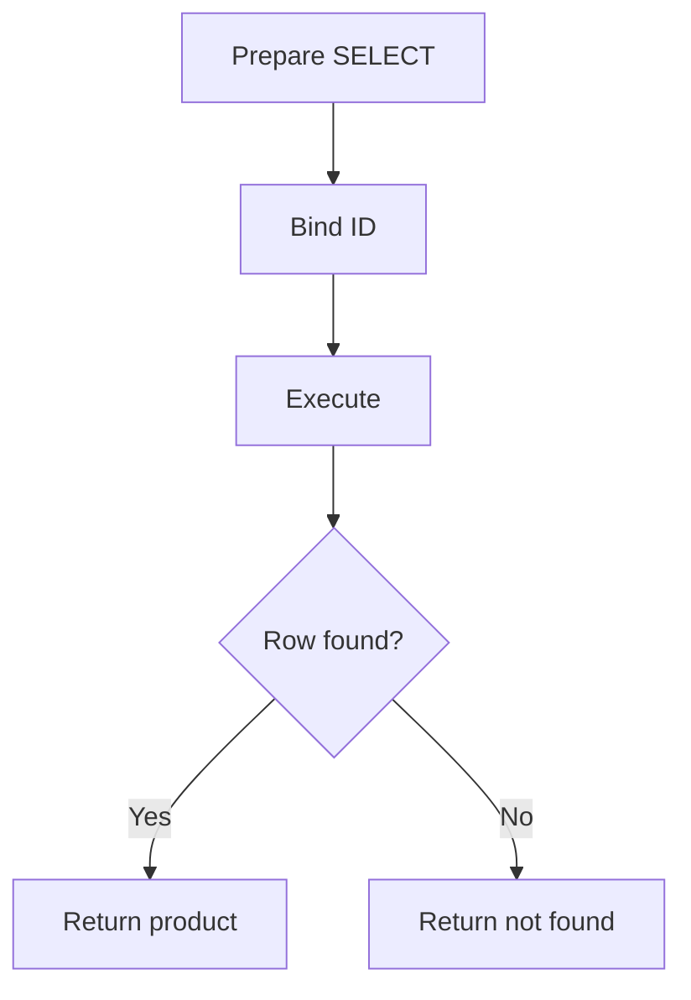

# Select Data with PHP PDO

## Table of Contents

- [1. Select All Rows](#1-select-all-rows)
- [2. Select One Row](#2-select-one-row)
- [3. Fetch Modes](#3-fetch-modes)
- [4. Fetch One Column](#4-fetch-one-column)
- [5. Repository Example](#5-repository-example)
- [6. Common Mistakes](#6-common-mistakes)
- [7. Best Practices](#7-best-practices)
- [8. Official Documentation](#8-official-documentation)

---

## 1. Select All Rows

Use `query()` only when the SQL contains no untrusted values.

```php
<?php

$statement = $pdo->query(
    'SELECT
        id,
        name,
        slug,
        price,
        stock,
        status,
        created_at
     FROM products
     WHERE deleted_at IS NULL
     ORDER BY id DESC'
);

$products = $statement->fetchAll();

foreach ($products as $product) {
    echo $product['name'] . PHP_EOL;
}
```

Select only the columns the application needs.

---

## 2. Select One Row

```php
<?php

$statement = $pdo->prepare(
    'SELECT
        id,
        name,
        slug,
        description,
        price,
        stock,
        status,
        created_at,
        updated_at
     FROM products
     WHERE id = :id
       AND deleted_at IS NULL
     LIMIT 1'
);

$statement->execute(['id' => 10]);
$product = $statement->fetch();

if ($product === false) {
    http_response_code(404);
    exit('Product not found.');
}
```



---

## 3. Fetch Modes

| Mode | Result |
|---|---|
| `PDO::FETCH_ASSOC` | Associative array |
| `PDO::FETCH_OBJ` | Anonymous object |
| `PDO::FETCH_CLASS` | Class instance |

Associative array:

```php
$product = $statement->fetch(PDO::FETCH_ASSOC);
```

Object:

```php
$product = $statement->fetch(PDO::FETCH_OBJ);
```

A project-wide `PDO::FETCH_ASSOC` default is simple and predictable for beginners.

---

## 4. Fetch One Column

Use `fetchColumn()` for counts or a single scalar value.

```php
<?php

$total = (int) $pdo
    ->query(
        'SELECT COUNT(*)
         FROM products
         WHERE deleted_at IS NULL'
    )
    ->fetchColumn();
```

---

## 5. Repository Example

```php
<?php

declare(strict_types=1);

final class ProductRepository
{
    public function __construct(
        private readonly PDO $pdo
    ) {
    }

    public function findById(int $id): ?array
    {
        $statement = $this->pdo->prepare(
            'SELECT id, name, slug, description, price, stock, status
             FROM products
             WHERE id = :id
               AND deleted_at IS NULL
             LIMIT 1'
        );

        $statement->execute(['id' => $id]);
        $product = $statement->fetch();

        return $product === false ? null : $product;
    }
}
```

A repository keeps SQL out of controllers and templates.

---

## 6. Common Mistakes

- Using `SELECT *` everywhere.
- Calling `query()` with concatenated user input.
- Forgetting `LIMIT 1` for unique lookups.
- Assuming `fetch()` always returns an array.
- Forgetting soft-delete conditions.
- Loading thousands of rows without pagination.
- Rendering database text without HTML escaping.

---

## 7. Best Practices

- Use prepared statements for dynamic values.
- Select only required columns.
- Check strictly for `false`.
- Add indexes for frequent lookups.
- Paginate large result sets.
- Keep authorization checks outside or above the repository.
- Escape output when rendering HTML.

---

## 8. Official Documentation

- [PDO::query()](https://www.php.net/manual/en/pdo.query.php)
- [PDOStatement::fetch()](https://www.php.net/manual/en/pdostatement.fetch.php)
- [PDOStatement::fetchAll()](https://www.php.net/manual/en/pdostatement.fetchall.php)
- [PDOStatement::fetchColumn()](https://www.php.net/manual/en/pdostatement.fetchcolumn.php)
