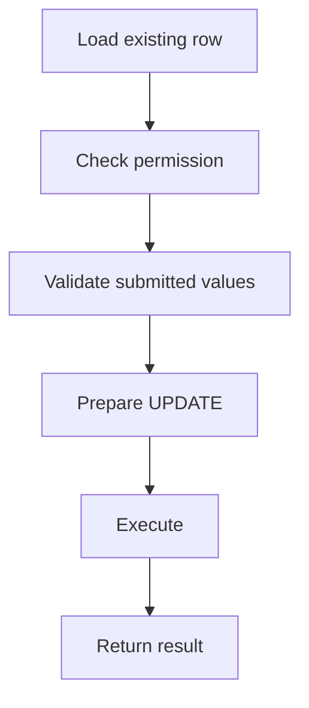

# Update Data with PHP PDO

## Table of Contents

- [1. Basic Update](#1-basic-update)
- [2. Validate Before Updating](#2-validate-before-updating)
- [3. Check the Result](#3-check-the-result)
- [4. Safe Partial Updates](#4-safe-partial-updates)
- [5. Transactions](#5-transactions)
- [6. Common Mistakes](#6-common-mistakes)
- [7. Best Practices](#7-best-practices)
- [8. Official Documentation](#8-official-documentation)

---

## 1. Basic Update

```php
<?php

$statement = $pdo->prepare(
    'UPDATE products
     SET
        name = :name,
        price = :price,
        stock = :stock,
        status = :status,
        updated_at = :updated_at
     WHERE id = :id
       AND deleted_at IS NULL'
);

$statement->execute([
    'id' => 10,
    'name' => 'Mechanical Keyboard',
    'price' => '65.00',
    'stock' => 15,
    'status' => 'active',
    'updated_at' => gmdate('Y-m-d H:i:s'),
]);
```



---

## 2. Validate Before Updating

```php
<?php

$name = trim($_POST['name'] ?? '');
$status = $_POST['status'] ?? '';
$allowedStatuses = ['active', 'inactive'];

$errors = [];

if ($name === '') {
    $errors['name'] = 'Name is required.';
}

if (!in_array($status, $allowedStatuses, true)) {
    $errors['status'] = 'Invalid status.';
}
```

Also verify that the current user is allowed to modify the row.

---

## 3. Check the Result

```php
<?php

if ($statement->rowCount() === 0) {
    echo 'No row was changed.';
}
```

A zero row count may mean:

- the row does not exist;
- the row was soft deleted;
- the submitted values are unchanged;
- driver behavior differs.

When existence matters, select the row first or perform a separate existence check.

---

## 4. Safe Partial Updates

Build dynamic assignments only from an application-controlled allowlist.

```php
<?php

$allowedFields = [
    'name' => 'name',
    'price' => 'price',
    'stock' => 'stock',
    'status' => 'status',
];

$assignments = [];
$parameters = ['id' => $productId];

foreach ($allowedFields as $inputKey => $column) {
    if (array_key_exists($inputKey, $input)) {
        $assignments[] = "{$column} = :{$inputKey}";
        $parameters[$inputKey] = $input[$inputKey];
    }
}

if ($assignments === []) {
    throw new InvalidArgumentException('No fields to update.');
}

$assignments[] = 'updated_at = :updated_at';
$parameters['updated_at'] = gmdate('Y-m-d H:i:s');

$sql = sprintf(
    'UPDATE products SET %s WHERE id = :id AND deleted_at IS NULL',
    implode(', ', $assignments)
);

$statement = $pdo->prepare($sql);
$statement->execute($parameters);
```

Never use request-provided column names directly.

---

## 5. Transactions

Use a transaction when one update depends on other writes.

```php
<?php

$pdo->beginTransaction();

try {
    $updateProduct->execute($productData);
    $insertAuditLog->execute($auditData);

    $pdo->commit();
} catch (Throwable $throwable) {
    if ($pdo->inTransaction()) {
        $pdo->rollBack();
    }

    throw $throwable;
}
```

---

## 6. Common Mistakes

- Missing the `WHERE` clause.
- Trusting submitted IDs or ownership.
- Allowing arbitrary column names.
- Assuming `rowCount() === 0` means not found.
- Updating related tables without a transaction.
- Forgetting the `updated_at` field.
- Concatenating values into SQL.

---

## 7. Best Practices

- Validate all new values.
- Verify authorization and ownership.
- Use prepared statements.
- Keep dynamic identifiers behind allowlists.
- Use optimistic locking for important concurrent updates when needed.
- Use transactions for related writes.
- Log meaningful changes without storing sensitive data.

---

## 8. Official Documentation

- [PDO prepared statements](https://www.php.net/manual/en/pdo.prepared-statements.php)
- [PDOStatement::execute()](https://www.php.net/manual/en/pdostatement.execute.php)
- [PDOStatement::rowCount()](https://www.php.net/manual/en/pdostatement.rowcount.php)
- [PDO transactions](https://www.php.net/manual/en/pdo.transactions.php)
