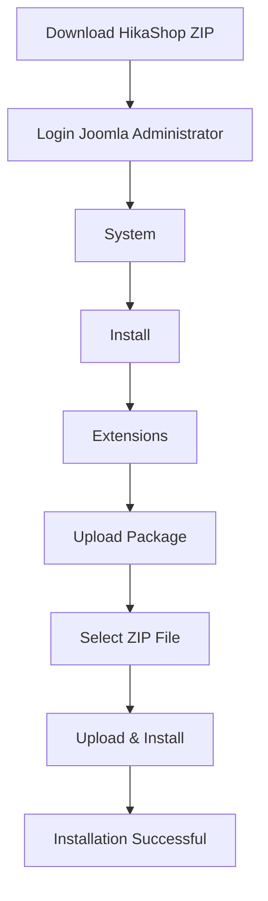
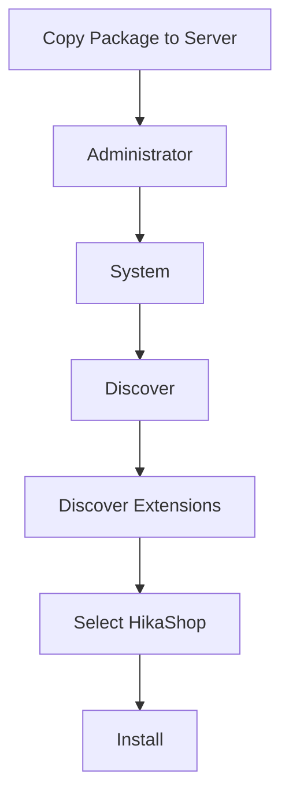
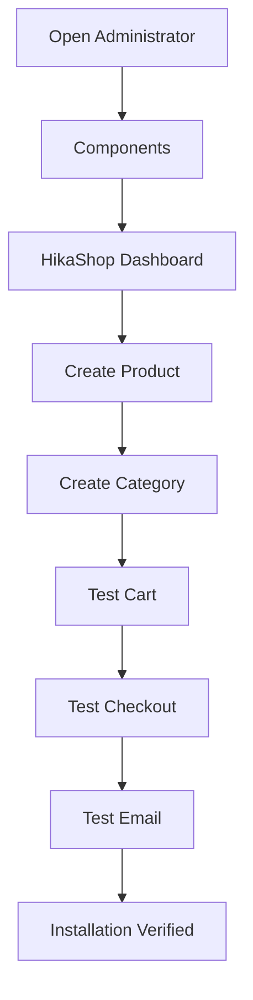

# HikaShop 6.5.2 Installation Guide (Joomla 6)

> **Version:** 6.5.2
>
> **Compatibility:** Joomla 4 / 5 / 6
>
> **Recommended for Migration:** ✅ Yes
>
> **Official Website:** https://www.hikashop.com
>
> **Download:** https://www.hikashop.com/download.html

---

# Table of Contents

- [1. Download HikaShop](#1-download-hikashop)
- [2. Install via Joomla Installer](#2-install-via-joomla-installer)
- [3. Install via Discover](#3-install-via-discover)
- [4. Upgrade Free to Business / Essential](#4-upgrade-free-to-business--essential)
- [5. Verify Installation](#5-verify-installation)
- [6. Migration Notes](#6-migration-notes)

---

# 1. Download HikaShop

## Free Edition

Download from:

- Official Website  
  https://www.hikashop.com/download.html

- Joomla Extension Directory  
  https://extensions.joomla.org/extension/e-commerce/shopping-cart/hikashop/

---

## Business / Essential Edition

Login:

https://www.hikashop.com

Then:

```text
My Account
    ↓
Downloads
    ↓
Business / Essential Package
```

---

# 2. Install via Joomla Installer

## Flow



---

## Steps

### Step 1

Login Administrator

```text
https://your-domain/administrator
```

---

### Step 2

Navigate

```text
System
    ↓
Install
    ↓
Extensions
```

---

### Step 3

Select

```text
Upload Package File
```

---

### Step 4

Choose

```text
com_hikashop_v6.5.2.zip
```

---

### Step 5

Click

```text
Upload & Install
```

---

### Step 6

Expected Result

```text
Installation of the package was successful.
```

---

# 3. Install via Discover

> Only use this method when the package has already been copied manually to the Joomla installation.

## Flow



---

## Steps

1. Copy the package manually.
2. Open:

```text
System
↓
Discover
```

3. Click:

```text
Discover
```

4. If HikaShop appears, select it and click:

```text
Install
```

---

# 4. Upgrade Free to Business / Essential

One of HikaShop's advantages is that **you do not need to uninstall the Free Edition**.

## Upgrade Flow


---

## Upgrade Steps

### Step 1

Install:

```text
HikaShop Starter
```

---

### Step 2

Configure your store normally.

---

### Step 3

Purchase a Business or Essential license.

---

### Step 4

Download:

```text
Business ZIP
```

---

### Step 5

Install using:

```text
System
↓
Install
↓
Extensions
```

Upload:

```text
Business ZIP
```

---

### Result

Existing data remains intact:

- Products
- Categories
- Customers
- Orders
- Configuration
- Database

Only Business features are unlocked.

---

# 5. Verify Installation

## Verification Flow



---

## Checklist

### Administrator

- [ ] Components → HikaShop exists

---

### Dashboard

- [ ] Dashboard opens successfully

---

### Version

Verify:

```text
Components
↓
HikaShop
↓
About
```

Expected:

```text
Version
6.5.2
```

---

### Product

- [ ] Create Product

---

### Category

- [ ] Create Category

---

### Customer

- [ ] Customer page loads

---

### Order

- [ ] Orders page loads

---

### Frontend

- [ ] Product List
- [ ] Product Detail
- [ ] Category

---

### Shopping Cart

- [ ] Add to Cart
- [ ] Remove Item
- [ ] Update Quantity

---

### Checkout

- [ ] Payment
- [ ] Shipping
- [ ] Order Created

---

### Email

- [ ] Customer Email
- [ ] Admin Email

---

### PHP

- [ ] No Fatal Error
- [ ] No Deprecated Warning
- [ ] No White Screen

---

# 6. Migration Notes

When migrating from **HikaShop 3.5.1** to **6.5.2**, verify:

- [ ] Products
- [ ] Categories
- [ ] Customers
- [ ] Orders
- [ ] Coupons
- [ ] Taxes
- [ ] Shipping Methods
- [ ] Payment Plugins
- [ ] Email Templates
- [ ] Custom Plugins
- [ ] Template Overrides
- [ ] PHP 8.3 / PHP 8.4 Compatibility

---

# Recommended Installation Method

| Method | Recommendation |
|---|---|
| Joomla Installer | ⭐⭐⭐⭐⭐ Recommended |
| Discover | ⭐⭐ Only when required |
| Upgrade Free → Business | ⭐⭐⭐⭐⭐ Recommended |

---

# Summary

✅ Install Starter Edition

↓

✅ Verify Installation

↓

✅ Upgrade to Business / Essential

↓

✅ Test Products

↓

✅ Test Orders

↓

✅ Test Checkout

↓

✅ Ready for Production